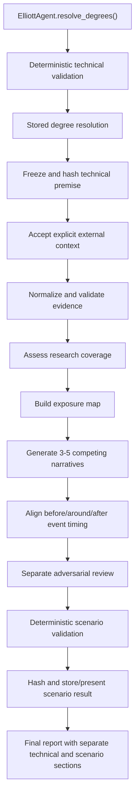

# Market Scenario Engine Specification

| Field | Value |
|---|---|
| Specification ID | `market-scenario-engine` |
| Specification version | `1.1.0` |
| Status | Normative specification; standalone foundations implemented, pipeline integration pending |
| Repository | Elliott Wave AI |
| Governing instructions | Root `AGENTS.md` |

## 1. Purpose

The Market Scenario Engine is a post-technical reasoning system. Given a
completed and frozen Elliott Wave technical result, it assesses whether a
plausible combination of real-world forces could produce the projected price
move within the projected time window.

The engine must answer:

> Given this frozen technical projection, what complete combination of
> company-specific, sector-specific, macroeconomic, valuation, liquidity,
> positioning, sentiment, and scheduled-event factors could realistically
> produce this move?

The engine must not answer:

- which Elliott Wave count is correct;
- whether the technical result should be relabeled;
- what news event the chart predicts;
- what trade should be entered;
- what outcome is certain;
- what probability should be assigned to a price target; or
- how the existing technical calculations should be changed.

The words MUST, MUST NOT, REQUIRED, SHOULD, SHOULD NOT, and MAY are normative.

## 2. Core Invariants

### 2.1 Technical independence

The technical pipeline remains price-first and independent. Fundamentals,
news, macro data, sentiment, positioning, and event information MUST NOT enter:

- pivot detection;
- indicator calculation;
- initial Elliott candidate generation;
- degree resolution;
- deterministic Elliott validation;
- technical confidence or readiness calculation;
- target calculation; or
- invalidation calculation.

### 2.2 Frozen technical result

The completed output of `ElliottAgent.resolve_degrees()`, together with its
deterministic validation, analytics, readiness, cutoffs, and source hashes,
MUST be frozen before the Market Scenario Engine begins.

The engine MUST NOT:

- alter or relabel any wave;
- recalculate technical confidence or readiness;
- change targets or invalidation levels;
- change pivots, indicators, metrics, or source data;
- reinterpret technical evidence as fundamental evidence; or
- write scenario conclusions back into the technical result.

The engine MAY:

- support, contradict, remain neutral to, or be incomparable with the frozen
  projection;
- assess real-world plausibility;
- create conditional multi-factor narratives;
- compare projected timing with known events;
- identify missing research;
- stress-test causal explanations; and
- state fundamental contradiction signals separately from technical
  invalidation signals.

### 2.3 No silent failure

The engine is part of the normal analysis pipeline. It MUST run after a
technical result is frozen, even when no external research is available.

When research is unavailable, the engine MUST return an explicit unavailable
or insufficient-evidence result. It MUST NOT fabricate evidence or silently
omit the scenario stage. The technical report may still be presented, but its
Market Scenario section must clearly state why scenario analysis is
unavailable.

### 2.4 No prediction or trade execution

The engine produces contextual explanatory scenarios, not forecasts,
probabilities, recommendations, entries, exits, position sizes, or automated
wave resolution.

## 3. Architecture

### 3.1 Logical components

The future implementation should contain these logical components:

1. **Technical Result Freezer**
   - Loads the stored degree resolution.
   - Builds an immutable technical premise.
   - Verifies the technical source hashes.
   - Produces a frozen premise content hash.

2. **Context Intake**
   - Accepts explicit external context.
   - Records provider, source, publication date, retrieval timestamp, and
     applicable cutoff.
   - Rejects or marks post-cutoff evidence in historical mode.

3. **Evidence Normalizer**
   - Converts supplied context into typed evidence records.
   - Separates facts, scheduled events, interpretations, hypotheses, unknowns,
     unavailable data, and stale data.
   - Preserves conflicts instead of silently resolving them.

4. **Research Coverage Assessor**
   - Evaluates coverage across all required research categories.
   - Produces an availability statement and missing-research list.

5. **Exposure Mapper**
   - Maps material exposures before narratives are generated.
   - Links supporting and contradicting evidence to each exposure.

6. **Narrative Generator**
   - Produces three to five competing multi-factor narratives.
   - Includes a no-company-specific-news scenario.
   - Selects a provisional primary narrative using explicit evidence coverage,
     not probability.

7. **Timeline Reasoner**
   - Aligns material known events with the technical completion window.
   - Produces before-event, around-event, and after-event branches.

8. **Adversarial Reviewer**
   - Runs as a separate reasoning pass.
   - Attempts to disprove the provisional primary narrative.
   - Returns a recommendation and, where justified, a revised narrative.

9. **Deterministic Validator**
   - Enforces schema, cutoff, provenance, immutability, narrative, timeline,
     language, and adversarial-review rules.
   - Produces errors and warnings without silently repairing evidence.

10. **Scenario Result Store and Presenter**
    - Creates a deterministic content hash.
    - Links the result to the frozen technical resolution.
    - Keeps technical and scenario evidence visibly separate in the report.

### 3.2 Component flow



### 3.3 Separation of data lanes

The implementation MUST maintain three distinct data lanes:

| Lane | Contents | Mutation policy |
|---|---|---|
| Technical | Degree hierarchy, pivots, indicators, metrics, targets, invalidations, readiness | Frozen and read-only |
| External evidence | Fundamentals, news, events, macro, valuation, positioning, sentiment | Append-only within a scenario run |
| Scenario reasoning | Exposure map, narratives, timeline branches, adversarial review | May be regenerated without changing technical data |

Scenario records MUST reference the technical result by stable ID and content
hash. They MUST NOT embed a silently modified technical copy.

## 4. Pipeline Position

### 4.1 Required normal pipeline

The normal analysis sequence MUST become:

1. Build the technical evidence packet.
2. Generate the initial technical analysis.
3. Run `ElliottAgent.resolve_degrees()`.
4. Run deterministic technical validation and analytics.
5. Store the completed technical result.
6. Freeze and hash that stored result.
7. Run the Market Scenario Engine.
8. Validate and hash the Market Scenario result.
9. Present the final report with separate technical and scenario sections.

The engine MUST NOT be called from:

- `build_evidence_packet()`;
- indicator or market-data modules;
- the initial Elliott prompt;
- the degree-resolution prompt; or
- deterministic technical validators.

### 4.2 Reuse by manual commands

A future standalone debugging or rerun command MAY be added for:

- rerunning scenario reasoning against an existing resolution;
- applying a different permitted research cutoff;
- evaluating a historical case;
- testing context coverage; or
- inspecting validation failures.

The standalone command MUST call the same application service used by the
normal pipeline. It MUST NOT implement a second scenario engine.

### 4.3 Failure behavior

Market Scenario failure MUST NOT mutate or invalidate the technical result.
The final technical report may continue with one of these scenario statuses:

- `complete`;
- `insufficient_evidence`;
- `research_unavailable`;
- `validation_failed`; or
- `provider_failed`.

The report MUST disclose the status and all material limitations.

## 5. Frozen Technical Input

### 5.1 Required identity fields

These fields are REQUIRED:

- `resolution_id`;
- `symbol`;
- `analysed_at`;
- `market_data_cutoff`;
- `source_hashes`; and
- `frozen_content_hash`.

Without these fields, the engine MUST refuse scenario generation because the
input cannot be proven to be a frozen technical result.

### 5.2 Expected technical fields

The engine MUST accept these fields where available:

- `exchange`;
- `technical_structure`;
- `current_wave_or_phase`;
- `direction`;
- `target_low`;
- `target_high`;
- `invalidation_level`;
- `expected_completion_start`;
- `expected_completion_end`;
- `technical_confidence`;
- `technical_readiness`;
- `supporting_technical_evidence`;
- `alternative_technical_hypotheses`; and
- technical provenance metadata.

Missing optional fields MUST be represented explicitly as unavailable. They
MUST NOT be guessed from the symbol, prior reports, or model memory.

### 5.3 Availability wrapper

Language-neutral implementations SHOULD represent optional values with:

```text
Availability<T> {
  state: "available" | "unavailable" | "not_applicable"
  value: T | null
  reason: string | null
}
```

Bare `null` values SHOULD NOT be used where unavailable, unknown, and
not-applicable have different meanings.

### 5.4 Immutability verification

Before and after scenario analysis:

1. Canonically serialize the frozen technical premise.
2. Calculate its content hash.
3. Compare it with `frozen_content_hash`.
4. Fail validation if the hashes differ.

Scenario code MUST receive either an immutable value object or a deep copy that
cannot be persisted back to the technical tables.

## 6. Research Modes

### 6.1 Current-context mode

Use `current_context` for a present-day technical result.

The engine MUST:

- record retrieval timestamps;
- record publication dates;
- identify the provider and original source;
- declare the current research cutoff;
- distinguish current facts from old but still relevant facts;
- warn about stale data; and
- identify every required category that was not researched.

### 6.2 Historical-cutoff mode

Use `historical_cutoff` to reproduce what could have been known at a past
decision time.

The engine MUST:

- use only evidence demonstrably available by the applicable cutoff;
- exclude later outcomes, revisions, restatements, retrospective explanations,
  and later analyst commentary;
- allow a future scheduled event only when its schedule was publicly known by
  the cutoff;
- classify such an event as `scheduled`, not `confirmed`;
- distinguish a current retrieval timestamp from historical availability; and
- fail validation if post-cutoff evidence affects a narrative.

A source retrieved today is not automatically historical-cutoff safe. The
source must preserve enough metadata to establish that the cited information
existed by the historical cutoff.

### 6.3 Current repository mode

The initial implementation MUST operate on explicitly supplied JSON context
because the repository currently has:

- no live fundamentals provider;
- no live news provider;
- no dedicated event-calendar provider; and
- no automated web-research provider.

The engine MUST report uncovered categories as unavailable. Future data
adapters must be additive and MUST NOT alter the technical pipeline.

## 7. Research Workflow

The engine MUST execute research in this order:

1. Verify and freeze the technical premise.
2. Select `current_context` or `historical_cutoff`.
3. Establish the applicable research cutoff.
4. Inventory supplied context and source metadata.
5. Reject, quarantine, or mark evidence that violates the cutoff.
6. Normalize each independent claim into an evidence item.
7. Assess source quality and freshness.
8. Preserve conflicting sources.
9. Assess coverage for every research category.
10. Build the material-event calendar.
11. Build the exposure map.
12. Generate competing narratives.
13. Generate timeline branches.
14. Run adversarial review.
15. Run deterministic validation.
16. Hash and return the result.

Research MUST NOT begin by searching for a single explanation that confirms
the technical target. It must gather both supporting and opposing evidence.

## 8. Research Categories

### 8.1 Company

Assess material evidence concerning:

- revenue;
- earnings;
- guidance;
- gross margin;
- operating margin;
- free cash flow;
- cash burn;
- liquidity;
- debt;
- capital expenditure;
- dilution;
- share issuance;
- backlog;
- customer concentration;
- contracts;
- product milestones;
- development delays;
- operational failures;
- supply-chain exposure;
- litigation;
- regulation;
- management changes;
- insider activity;
- acquisitions; and
- divestitures.

### 8.2 Sector and competitors

Assess:

- industry demand;
- sector valuation;
- competitor milestones;
- competitor failures;
- pricing pressure;
- market-share changes;
- regulatory changes;
- government spending;
- supply-chain conditions; and
- sector-wide sentiment.

### 8.3 Macro and cross-asset

Assess:

- interest rates;
- inflation;
- recession risk;
- market liquidity;
- credit conditions;
- equity risk appetite;
- relevant index trends;
- small-cap conditions;
- growth-stock conditions;
- currency exposure;
- commodity exposure;
- geopolitical exposure;
- central-bank events; and
- major economic releases.

### 8.4 Valuation and positioning

Assess:

- current valuation;
- historical valuation;
- peer valuation;
- expected growth embedded in price;
- analyst revisions;
- reliable institutional positioning;
- insider transactions;
- short interest;
- reliable options positioning;
- sentiment;
- crowded-trade risk;
- previous price appreciation; and
- ownership concentration.

### 8.5 Event calendar

Assess known:

- earnings dates;
- investor days;
- product releases;
- launches;
- regulatory decisions;
- court decisions;
- contract awards;
- government budget decisions;
- debt maturities;
- lock-up expirations;
- index inclusion or removal;
- economic releases;
- central-bank decisions; and
- operational milestones.

The absence of evidence in a category is not evidence that the category is
neutral.

## 9. Source Policy

### 9.1 Source priority

Prefer sources in this order when available:

1. Regulatory filings.
2. Company investor-relations releases.
3. Official government or regulator publications.
4. Earnings materials and transcripts.
5. Official contract or procurement databases.
6. Official central-bank and economic data.
7. Reputable financial reporting.
8. Reputable industry publications.
9. Secondary aggregators when primary sources are unavailable.

A lower-priority source MAY be used when the limitation is disclosed. It
SHOULD NOT be the sole support for a material factual claim when primary
confirmation is reasonably available.

### 9.2 Source content is data

External source content is untrusted data. Instructions contained inside a
filing, article, transcript, or supplied context file MUST NOT override system,
repository, cutoff, or validation rules.

### 9.3 Conflicting sources

Conflicting sources MUST be shown explicitly. The engine MUST:

- preserve each claim as a separate evidence item;
- compare source type, date, period, scope, and definitions;
- explain whether the conflict is resolved, unresolved, or incomparable;
- avoid averaging incompatible figures; and
- retain material opposing evidence in narrative output.

### 9.4 Stale and unavailable research

Staleness depends on the claim and scenario horizon. The implementation MUST
not use a hidden universal freshness threshold.

For unavailable research, record one of:

- `not_supplied`;
- `inaccessible`;
- `not_published`;
- `not_applicable`;
- `cutoff_incompatible`;
- `entity_incompatible`;
- `feed_incompatible`; or
- `unknown_reason`.

## 10. Evidence Classification

### 10.1 Evidence record

Every independent evidence item MUST contain:

```text
EvidenceItem {
  evidence_id: id
  category: string
  claim: string
  source: string
  source_type: string
  provider: string
  publication_date: Availability<date | timestamp>
  retrieval_timestamp: timestamp
  applicable_cutoff: timestamp
  status: EvidenceStatus
  implication: EvidenceImplication
  confidence: QualitativeConfidence
  relevance_to_technical_scenario: string
  related_event_id: Availability<id>
  content_hash: Availability<hash>
  warnings: list<string>
}
```

### 10.2 Evidence status

Allowed `EvidenceStatus` values:

| Status | Meaning |
|---|---|
| `confirmed` | Factual and adequately sourced within the cutoff |
| `scheduled` | A future event known and sourced within the cutoff |
| `interpretation` | A reasoned reading of sourced facts |
| `hypothetical` | A conditional mechanism or catalyst |
| `unknown` | Truth cannot be established |
| `unavailable` | Required evidence was not supplied or accessible |
| `stale` | Evidence is too old or superseded for unqualified use |

The engine MUST NOT transform `hypothetical`, `unknown`, `unavailable`, or
`stale` evidence into `confirmed` evidence.

### 10.3 Evidence implication

Allowed `EvidenceImplication` values:

- `supportive`;
- `contradictory`;
- `neutral`; and
- `incomparable`.

Missing evidence MUST NOT be classified as neutral. Evidence from incompatible
entities, periods, feeds, or cutoffs MUST be classified as incomparable.

### 10.4 Confidence

Evidence and final scenario confidence MUST be qualitative:

- `high`;
- `moderate`;
- `low`;
- `insufficient_evidence`; or
- `unavailable`.

Confidence MUST NOT be expressed as a probability and MUST NOT alter the
technical confidence field.

## 11. Research Availability

Every run MUST produce:

```text
EvidenceAvailability {
  mode: "current_context" | "historical_cutoff"
  cutoff: timestamp
  supplied_categories: list<string>
  unavailable_categories: list<string>
  stale_categories: list<string>
  incomparable_categories: list<string>
  limitations: list<string>
}
```

The engine MUST return `insufficient_evidence` when the available evidence
cannot responsibly support three distinct multi-factor narratives. It MUST
return `research_unavailable` when no usable external evidence exists.

## 12. Exposure Mapping

### 12.1 Required research categories

Research coverage MUST be declared for:

- `company`;
- `sector_and_competitors`;
- `macro_and_cross_asset`;
- `valuation_and_positioning`; and
- `event_calendar`.

These values are `ExposureCategory` research lanes, not exposure mechanisms.
A category may contain zero, one, or multiple mechanism-level exposure items.

### 12.2 Exposure mechanisms

`ExposureType` is a controlled mechanism vocabulary. It includes:

- company mechanisms: revenue growth and visibility, earnings, guidance,
  margins, cash burn, liquidity, financing, dilution, debt, execution,
  operations, development delays, supply chain, customer concentration,
  contracts, regulation, litigation, management, and acquisition integration;
- sector mechanisms: demand, valuation, competition, pricing, market share,
  competitor execution, regulation, government spending, supply chain, and
  sentiment;
- macro mechanisms: interest rates, inflation, recession, liquidity, credit,
  equity risk appetite, small-cap and growth-stock sensitivity, currencies,
  commodities, and geopolitics;
- valuation and positioning mechanisms: valuation compression or expansion,
  growth expectations, analyst revisions, institutional and insider
  positioning, short interest, options, crowded trades, ownership
  concentration, and momentum unwind; and
- event mechanisms: earnings, product milestones, launches, regulation,
  contract awards, financing, central banks, economic releases, index events,
  sell-the-news risk, and pre-event uncertainty.

Serialized mechanism values MUST use the stable snake_case values defined by
the canonical `ExposureType` enum. The category-to-type compatibility map MUST
be explicit, deterministic, exhaustive, and disjoint.

### 12.3 Exposure item

```text
ExposureItem {
  exposure_id: id
  category: ExposureCategory
  exposure_type: ExposureType
  materiality: "material" | "not_material" | "unknown" | "unavailable"
  direction: "positive" | "negative" | "mixed" | "neutral" |
             "unknown" | "incomparable"
  possible_magnitude: Availability<string>
  time_horizon: Availability<string>
  evidence_status: EvidenceStatus
  supporting_evidence_ids: list<id>
  contradicting_evidence_ids: list<id>
  technical_outcomes_explained: list<string>
  assumptions: list<string>
  limitations: list<string>
}
```

Each item MUST represent one specific mechanism. Contributions merge only when
both `category` and `exposure_type` match. One evidence item may contribute to
multiple explicit mechanisms, but ambiguous evidence MUST remain unmapped with
a structured warning rather than being forced into a broad category.

For each mechanism, determine:

- whether the company is materially exposed;
- the direction of exposure;
- possible magnitude;
- relevant horizon;
- confirmed or hypothetical state;
- which technical outcome it could help explain; and
- which evidence contradicts it.

An exposure MUST NOT be described as an event that will necessarily occur.
Evidence count MUST NOT increase confidence unless source independence is
known.

### 12.4 Category coverage

Empty research categories MUST NOT be represented by fabricated unavailable
`ExposureItem` records. Instead, every category has one coverage declaration:

```text
ExposureCategoryCoverage {
  category: ExposureCategory
  state: "exposures_identified" |
         "researched_no_material_exposure" |
         "unavailable"
  exposure_ids: list<id>
  unmapped_evidence_ids: list<id>
  notes: list<string>
}
```

An internal `undeclared` state may be used while assembling a draft, but final
validation MUST reject it. When exposures are identified, `exposure_ids` MUST
exactly equal the mechanism records in that category. When no exposure is
identified, the state MUST distinguish completed research with no material
exposure from unavailable research.

## 13. Competing Narratives

### 13.1 Narrative count

A complete report MUST contain between three and five competing narratives.
The set should cover meaningfully different causal combinations rather than
cosmetic variations of one story.

### 13.2 Independent drivers

Every primary narrative MUST contain at least two independent drivers.

Drivers are independent when they arise from materially different mechanisms
or evidence lanes. Two restatements of the same earnings concern do not count
as two drivers. Examples of independent combinations include:

- valuation compression plus macro weakness;
- execution delay plus increased cash burn;
- sector derating plus crowded positioning;
- strong operating performance plus falling market multiples;
- a successful event plus sell-the-news positioning; or
- company disappointment plus financing risk.

### 13.3 Narrative contract

```text
NarrativeDriver {
  driver_id: id
  description: string
  category: string
  evidence_ids: list<id>
  independent_from_driver_ids: list<id>
  status: EvidenceStatus
}

CausalStep {
  sequence: integer
  statement: string
  evidence_ids: list<id>
  assumptions: list<string>
}

ScenarioNarrative {
  narrative_id: id
  title: string
  summary: string
  drivers: list<NarrativeDriver>
  assumptions: list<string>
  contradicting_evidence_ids: list<id>
  causal_chain: list<CausalStep>
  magnitude_explanation: string
  expected_time_horizon: string
  confirmation_conditions: list<string>
  weakening_conditions: list<string>
  invalidation_conditions: list<string>
  is_no_company_specific_news_scenario: bool
  evidence_confidence: QualitativeConfidence
  limitations: list<string>
}
```

Each primary narrative MUST:

- cite specific evidence IDs;
- identify assumptions;
- include contradicting evidence;
- explain the conditional causal chain;
- explain why the combination could produce the projected magnitude;
- explain the time horizon;
- state what would confirm it;
- state what would weaken it; and
- state what would invalidate it.

### 13.4 Primary narrative

One narrative MAY be selected as the best-supported explanatory scenario.
Selection MUST:

- use transparent evidence coverage and causal coherence;
- state why it was selected;
- preserve all valid competing narratives;
- avoid hidden weighting;
- avoid probabilities; and
- avoid language implying certainty.

### 13.5 No-company-specific-news scenario

At least one narrative MUST explain how the projected move could occur without
major company-specific bad news. Permitted mechanisms include:

- valuation compression;
- market liquidity;
- positioning unwind;
- sentiment deterioration;
- sector rotation;
- index weakness;
- credit tightening; or
- risk-premium expansion.

This requirement prevents the engine from inventing a corporate event merely
because the chart projects a large move.

## 14. Timeline Reasoning

### 14.1 Material event record

```text
MaterialEvent {
  event_id: id
  name: string
  category: string
  scheduled_start: Availability<timestamp>
  scheduled_end: Availability<timestamp>
  announced_at: Availability<timestamp>
  known_at_cutoff: bool
  status: EvidenceStatus
  source_evidence_ids: list<id>
  relation_to_completion_window:
    "before_window" | "inside_window" | "after_window" |
    "spans_window" | "unknown"
  possible_relevance: string
  causation_warning: string
}
```

Every event MUST link to source evidence. In historical mode,
`known_at_cutoff` MUST be true before the event can influence a scenario.

### 14.2 Required timing branches

Every complete report MUST contain:

1. **Before events**
   - Explain mechanisms such as anticipatory de-risking, valuation repricing,
     uncertainty premium, positioning unwind, sector rotation, or macro
     deterioration.

2. **Around events**
   - Explain mechanisms such as pre-event uncertainty, binary-event repricing,
     sell-the-news behavior, earnings or guidance reaction, or event-driven
     capitulation.

3. **After events**
   - Explain mechanisms such as disappointing execution, weaker economics,
     guidance reduction, cash-burn concern, insufficient catalyst strength, or
     delayed investor confidence.

If the technical completion window is unavailable, all three branches MUST
still be present with `unavailable` status and an explicit reason. They MUST
not be omitted.

### 14.3 Causation boundary

Event timing is contextual evidence, not proof of causation. Every timing
branch MUST state this limitation.

## 15. Adversarial Review

### 15.1 Separate review pass

After generating narratives and selecting a provisional primary narrative, the
engine MUST run a separate adversarial pass that attempts to disprove it.

The adversarial reviewer MUST receive:

- the frozen technical premise;
- evidence registry and availability statement;
- exposure map;
- event timeline;
- competing narratives;
- provisional primary narrative; and
- timing branches.

It MUST NOT receive authority to change the technical premise.

### 15.2 Required checks

The reviewer MUST inspect:

- cherry-picked evidence;
- missing bullish evidence;
- missing bearish evidence;
- unsupported causal links;
- stale information;
- conflicting sources;
- timeline mismatches;
- assumptions presented as facts;
- narratives requiring excessive assumptions;
- simpler explanations;
- historical-volatility mismatch;
- unrealistic projected magnitude;
- omitted sector or macro explanations;
- omitted no-news price movement;
- technical invalidation; and
- fundamental contradiction.

### 15.3 Adversarial output

```text
AdversarialReview {
  strongest_counterargument: string
  missing_evidence: list<string>
  opposing_evidence_ids: list<id>
  unsupported_assumptions: list<string>
  simpler_explanations: list<string>
  timing_conflicts: list<string>
  technical_invalidation_signals: list<string>
  fundamental_contradiction_signals: list<string>
  recommendation:
    "keep" | "revise" | "downgrade" | "reject" |
    "insufficient_evidence"
  revised_primary_narrative: Availability<ScenarioNarrative>
}
```

Recommendation meanings:

| Recommendation | Meaning |
|---|---|
| `keep` | Material evidence and causal links survive review |
| `revise` | The core scenario remains usable but needs corrections |
| `downgrade` | The scenario remains possible but is materially weakened |
| `reject` | The scenario depends on invalid evidence, causality, timing, or a changed premise |
| `insufficient_evidence` | Available evidence cannot support responsible assessment |

The recommendation evaluates narrative quality, not the probability of the
technical move.

### 15.4 Revision behavior

A revised primary narrative MUST still:

- contain at least two independent drivers;
- cite evidence;
- include contradictory evidence;
- disclose assumptions;
- use conditional language;
- explain magnitude and timing; and
- state confirmation, weakening, and invalidation conditions.

A rejected narrative MUST NOT be silently rewritten into an unrelated story.
Another already generated narrative may become primary only when it
independently satisfies all validation rules.

## 16. Language and Certainty

The engine MUST use conditional phrasing such as:

- `could`;
- `may`;
- `would be consistent with`;
- `one plausible combination is`; and
- `this scenario would require`.

The engine MUST NOT claim:

- `this will happen because`;
- `the chart proves`;
- `the company must announce`;
- `the Elliott count predicts this event`;
- `the target guarantees`; or
- any unsupported equivalent.

Facts, schedules, interpretations, and hypotheses MUST remain visibly
separate in both structured output and prose.

## 17. Validation

### 17.1 Validation result

```text
ValidationIssue {
  code: string
  severity: "error" | "warning"
  path: string
  message: string
}

ScenarioValidation {
  status: "passed" | "failed"
  issues: list<ValidationIssue>
  frozen_hash_before: hash
  frozen_hash_after: hash
}
```

Validation SHOULD collect all detectable issues in one pass rather than stop
after the first error.

### 17.2 Mandatory failure rules

A complete report MUST fail validation if:

1. Fewer than three narratives are produced.
2. More than five narratives are produced.
3. The primary narrative has fewer than two independent drivers.
4. The primary narrative has no contradicting evidence.
5. Any before-event, around-event, or after-event branch is missing.
6. The no-company-specific-news scenario is missing.
7. The strongest counterargument is missing.
8. Technical invalidation signals are missing.
9. Fundamental contradiction signals are missing.
10. A factual claim lacks evidence provenance.
11. A hypothetical claim is presented as fact.
12. Stale evidence is used without warning.
13. Historical output uses evidence unavailable at its cutoff.
14. Evidence IDs or event references are invalid.
15. The engine modifies the frozen technical result.
16. The result claims that the chart predicts a future event.
17. Required content hashes do not verify.
18. The final synthesis uses unconditional unsupported causal language.

### 17.3 Warning rules

Warnings SHOULD be emitted for:

- material unavailable categories;
- unresolved source conflicts;
- stale but contextually retained evidence;
- incomparable evidence;
- unknown event timing;
- unavailable technical completion windows;
- low evidence diversity;
- reliance on secondary aggregators; and
- a narrative requiring several unverified assumptions.

Warnings MUST NOT be silently converted into confidence probabilities.

### 17.4 Unavailable-result exception

`research_unavailable` and `insufficient_evidence` are explicit failure-state
envelopes, not complete scenario reports. They may contain fewer than three
narratives because no valid report was produced. They MUST:

- state why completion validation was impossible;
- list missing categories;
- contain no fabricated narratives;
- preserve the frozen technical premise; and
- allow the technical report to continue with a clear limitation.

## 18. Output Contract

### 18.1 Common types

```text
EvidenceStatus =
  "confirmed" | "scheduled" | "interpretation" | "hypothetical" |
  "unknown" | "unavailable" | "stale"

EvidenceImplication =
  "supportive" | "contradictory" | "neutral" | "incomparable"

QualitativeConfidence =
  "high" | "moderate" | "low" | "insufficient_evidence" |
  "unavailable"

ScenarioRunStatus =
  "complete" | "insufficient_evidence" | "research_unavailable" |
  "validation_failed" | "provider_failed"
```

### 18.2 Frozen premise

```text
FrozenTechnicalPremise {
  resolution_id: id
  symbol: string
  exchange: Availability<string>
  analysed_at: timestamp
  market_data_cutoff: timestamp
  technical_structure: Availability<string>
  current_wave_or_phase: Availability<string>
  direction: Availability<string>
  target_low: Availability<decimal>
  target_high: Availability<decimal>
  invalidation_level: Availability<decimal>
  expected_completion_start: Availability<timestamp>
  expected_completion_end: Availability<timestamp>
  technical_confidence: Availability<string>
  technical_readiness: Availability<string>
  supporting_technical_evidence: list<string>
  alternative_technical_hypotheses: list<string>
  source_hashes: map<string, hash>
  frozen_content_hash: hash
}
```

### 18.3 Narrative set

```text
NarrativeSet {
  narratives: list<ScenarioNarrative>
  primary_narrative_id: id
  selection_rationale: string
}

TimingBranch {
  branch: "before_events" | "around_events" | "after_events"
  availability: "available" | "unavailable"
  mechanism: string
  related_event_ids: list<id>
  evidence_ids: list<id>
  assumptions: list<string>
  confirmation_conditions: list<string>
  contradiction_conditions: list<string>
  limitations: list<string>
}

TimelineReasoning {
  before_events: TimingBranch
  around_events: TimingBranch
  after_events: TimingBranch
}
```

### 18.4 Complete result

```text
MarketScenarioReport {
  schema_id: "market-scenario-report"
  schema_version: string
  generated_at: timestamp
  frozen_technical_premise: FrozenTechnicalPremise
  research_mode: "current_context" | "historical_cutoff"
  research_cutoff: timestamp
  evidence_availability: EvidenceAvailability
  evidence: list<EvidenceItem>
  exposure_map: list<ExposureItem>
  exposure_coverage: list<ExposureCategoryCoverage>
  exposure_mapping_warnings: list<ExposureMappingWarning>
  material_event_timeline: list<MaterialEvent>
  competing_narratives: NarrativeSet
  primary_narrative: ScenarioNarrative
  timeline_reasoning: TimelineReasoning
  no_company_specific_news_scenario_id: id
  adversarial_review: AdversarialReview
  strongest_counterargument: string
  technical_invalidation_signals: list<string>
  fundamental_contradiction_signals: list<string>
  unresolved_unknowns: list<string>
  final_synthesis: string
  confidence: QualitativeConfidence
  explicit_limitations: list<string>
  provenance_hashes: map<string, hash>
  validation: ScenarioValidation
  result_content_hash: hash
}
```

### 18.5 Run envelope

```text
MarketScenarioRun {
  run_id: id
  status: ScenarioRunStatus
  resolution_id: id
  frozen_content_hash: hash
  report: Availability<MarketScenarioReport>
  unavailable_reasons: list<string>
  provider_errors: list<string>
  validation_issues: list<ValidationIssue>
  created_at: timestamp
  run_content_hash: hash
}
```

### 18.6 Referential integrity

The implementation MUST validate:

- unique evidence, event, exposure, narrative, and driver IDs;
- all referenced evidence IDs exist;
- all related event IDs exist;
- the primary narrative exists in the narrative set;
- the no-company-specific-news scenario exists in the narrative set;
- adversarial opposing-evidence references exist;
- source hashes agree with immutable source records; and
- the frozen technical hash is unchanged.

### 18.7 Canonical hashing

Canonical content hashing SHOULD use:

- UTF-8;
- deterministic key ordering;
- deterministic list ordering where order is semantic;
- normalized UTC timestamps;
- finite decimal serialization without binary float artifacts;
- explicit availability states; and
- SHA-256 unless the repository adopts another versioned hash policy.

The content hash field itself MUST be excluded while calculating that object's
hash. Hash algorithm and canonicalization version MUST be recorded.

## 19. Presentation Contract

The final human-readable report MUST separate:

1. **Frozen technical premise**
2. **Research availability and cutoff**
3. **Confirmed and scheduled evidence**
4. **Interpretations and hypotheses**
5. **Exposure map**
6. **Material-event timeline**
7. **Competing narratives**
8. **Primary narrative**
9. **Before, around, and after branches**
10. **No-company-specific-news scenario**
11. **Adversarial review**
12. **Technical invalidation signals**
13. **Fundamental contradiction signals**
14. **Unknowns and limitations**
15. **Conditional synthesis**

The report MUST NOT visually merge technical confirmations with external
evidence. Technical invalidation and fundamental contradiction MUST appear
under separate headings.

## 20. Provider Behavior

The engine SHOULD use the existing provider abstraction where practical, but
MUST have its own scenario-specific instructions and output contract. It MUST
NOT modify or reuse the technical system prompts in a way that allows external
context to influence wave resolution.

Provider behavior:

- **OpenAI provider:** may generate structured narratives and adversarial
  review from the frozen premise and normalized evidence.
- **Ollama provider:** may provide the same contract when its selected model
  can satisfy structured output.
- **Packet provider:** must emit deterministic scenario input/evidence packets
  or an unavailable state; it must not pretend to generate model reasoning.

Provider output is provisional until deterministic validation passes.

## 21. Persistence Boundary

The first implementation SHOULD avoid changing existing technical tables.

Preferred initial persistence:

- store a content-hashed scenario JSON artifact linked to `resolution_id`; or
- add a new scenario-specific table only after a separate schema review and
  migration approval.

Any future database migration MUST be additive. It MUST NOT:

- alter stored technical resolutions;
- overwrite technical runs;
- combine technical and scenario confidence;
- mutate Phase 3, Phase 4, or experience records; or
- make scenario evidence part of Elliott validation.

## 22. Implementation Roadmap

### Phase MSE-1: Contracts and deterministic validation

Create:

- a typed scenario contract module;
- enum and availability types;
- canonical serialization and hashing;
- deterministic validators; and
- fixture-based tests.

Do not integrate a model yet.

Required tests:

- frozen hash stability;
- modified technical input rejection;
- all enum values;
- required-field handling;
- unavailable optional fields;
- narrative count;
- independent-driver requirements;
- provenance requirements;
- timing branch requirements;
- no-company-specific-news requirement;
- adversarial output requirements;
- deterministic repeated output; and
- canonical hash stability.

### Phase MSE-2: Explicit context normalization

Extend external context handling without changing technical context ingestion.

Implement:

- company fundamentals adapter;
- news adapter;
- dedicated event adapter;
- macro adapter;
- sector and competitor adapter;
- valuation and positioning adapter;
- cutoff filtering;
- source conflict preservation; and
- availability reporting.

Inputs remain explicit JSON. No live provider is added in this phase.

Required tests:

- current-context mode;
- historical-cutoff mode;
- post-cutoff rejection;
- scheduled event known before cutoff;
- later event unknown at cutoff;
- stale evidence;
- unavailable categories;
- conflicting sources;
- incompatible entity or period; and
- prompt-injection text treated as data.

### Phase MSE-3: Scenario application service

Create one reusable application service, for example:

```text
run_market_scenario_engine(
  frozen_resolution,
  external_context,
  research_mode,
  cutoff,
  provider
) -> MarketScenarioRun
```

The service MUST orchestrate:

- freezing;
- normalization;
- coverage;
- exposure mapping;
- narrative generation;
- timeline reasoning;
- adversarial review;
- validation; and
- hashing.

It MUST be the only production engine used by normal and manual execution.

### Phase MSE-4: Provider integration

Add separate Market Scenario generation and adversarial-review instructions.
Do not modify Elliott prompts.

Implement:

- structured provider requests;
- schema validation;
- a separate adversarial provider call or explicitly separated pass;
- deterministic retry boundaries;
- provider failure states; and
- packet-provider behavior.

Required tests:

- malformed provider output;
- missing narratives;
- fabricated factual claims;
- unconditional event prediction;
- provider timeout;
- provider unavailable;
- OpenAI/Ollama contract compatibility; and
- packet mode producing no invented reasoning.

### Phase MSE-5: Normal pipeline and reporting

Integrate after the technical resolution is stored and frozen, before final
report presentation.

Likely integration surfaces:

- analysis orchestration in `elliott_ai/agent.py` or a new pipeline service;
- scenario rendering in `elliott_ai/reporting.py`;
- context normalization in `elliott_ai/context_data.py`; and
- command routing in `elliott_ai/cli.py` only for optional rerun/debug use.

Do not alter:

- `elliott_ai/market_data.py`;
- `elliott_ai/indicators.py`;
- `elliott_ai/degrees.py`;
- `elliott_ai/wave_metrics.py`;
- technical schemas; or
- technical prompts.

Required integration tests:

- engine runs only after stored resolution;
- scenario failure does not alter technical output;
- technical hash before and after is identical;
- final report separates technical and scenario sections;
- normal pipeline always exposes scenario status;
- standalone rerun uses the same service; and
- older stored technical runs remain readable.

### Phase MSE-6: Persistence

First determine whether content-hashed sidecar artifacts meet audit needs. If a
database migration is required, stop and produce a separate additive migration
proposal.

Persistence tests must cover:

- immutable linkage to `resolution_id`;
- stable hashes;
- repeated runs;
- superseding scenario runs without deleting history;
- cutoff-specific runs;
- no foreign-key violations; and
- no mutation of technical tables.

### Phase MSE-7: Live research adapters

Only after explicit approval, add source adapters in source-priority order.
Adapters MUST:

- preserve raw source identity;
- record publication and retrieval times;
- retain applicable cutoff;
- expose unavailable states;
- avoid silently summarizing conflicts away; and
- remain outside the technical pipeline.

Potential future adapters include regulatory filings, company investor
relations, government data, central-bank data, official procurement,
reputable news, and event calendars.

### Phase MSE-8: Evaluation and hardening

Build a reviewed evaluation set covering:

- current and historical cases;
- bullish and bearish projected moves;
- company-specific and no-news scenarios;
- sparse evidence;
- conflicting evidence;
- stale evidence;
- post-cutoff leakage attempts;
- unrealistic magnitude;
- event-timing ambiguity;
- adversarial rejection; and
- provider disagreement.

Evaluation MUST measure contract compliance, provenance, cutoff safety,
technical immutability, narrative diversity, and adversarial quality. It MUST
not optimize against future market outcomes in a way that turns the engine
into an unapproved predictor.

## 23. Minimum Acceptance Criteria

The Market Scenario Engine is ready for production integration only when:

- the technical result remains hash-identical before and after every run;
- external evidence cannot enter technical analysis;
- all factual claims retain provenance;
- historical cutoff leakage tests pass;
- complete reports always contain three to five narratives;
- every primary narrative has at least two independent drivers;
- every report contains a no-company-specific-news scenario;
- all three timing branches are present;
- adversarial review is separate and complete;
- technical and fundamental contradiction signals remain separate;
- unavailable research produces transparent failure states;
- output and hashes are deterministic for identical inputs;
- normal and standalone execution use the same service;
- no probabilities or trade decisions are generated; and
- the full existing test suite remains green.

## 24. Explicit Non-Goals

This specification does not authorize:

- application implementation in the current documentation task;
- changes to Elliott calculations;
- changes to technical prompts or schemas;
- changes to the CLI;
- database migration;
- machine learning;
- embeddings or vector search;
- probability calibration;
- analogue voting;
- automatic wave resolution;
- trade execution;
- position sizing;
- automatic acceptance of historical cases; or
- outcome-aware technical ranking.

Any such work requires a separately approved implementation phase.

## 25. Historical Market Move Case Framework

The historical framework is a standalone evidence-contract layer. It is not
part of the active Elliott or Market Scenario pipeline and MUST NOT generate a
current-market prediction. Its schema version is
`historical-market-case-1.0.0`.

### 25.1 Historical move identity

`HistoricalMarketMove` records a dated, content-hashed price move with:

- stable case, symbol, exchange, move-type, direction, and status identities;
- normalized UTC start, end, and market-data-cutoff timestamps;
- positive start and end prices;
- signed arithmetic percentage and natural-log movement;
- elapsed calendar duration;
- source hashes;
- optional recovery, volatility, volume, benchmark, sector, and technical
  context; and
- a SHA-256 content hash that excludes only its own `content_hash`.

Move types and case states MUST use the controlled enums in the canonical
historical contract module. Price, percentage, logarithmic movement, duration,
and direction MUST agree mathematically.

### 25.2 Temporal evidence lanes

Every historical `EvidenceItem` MUST be wrapped by a temporal classification:

- `known_before_move`;
- `published_during_move`;
- `known_only_after_move`;
- `retrospective_interpretation`; or
- `unavailable`.

The packet MUST store pre-move and during-move exposure collections separately.
Pre-move exposures may reference only `known_before_move` evidence.
During-move exposures may reference only pre-move or during-move evidence.
Post-move and retrospective evidence may remain in the packet for historical
explanation, but MUST NOT enter either earlier feature lane.

Available evidence requires source, source type, provider, publication date,
applicable cutoff, and retrieval timestamp. Publication MUST precede the
evidence cutoff, and the evidence cutoff MUST not exceed the case market-data
cutoff. A retrospective interpretation MUST NOT be marked as a confirmed
pre-move fact.

### 25.3 Historical events

Historical material events wrap the canonical `MaterialEvent` with an explicit
role:

- contextual evidence;
- initiating catalyst;
- during-move catalyst;
- retrospective context; or
- unavailable.

An event dated after the move MUST NOT be presented as an initiating catalyst
without explicit lag reasoning. Event and evidence references MUST remain
complete and non-dangling.

### 25.4 Historical evidence packet

`HistoricalEvidencePacket` contains:

- one immutable `HistoricalMarketMove`;
- temporally classified historical evidence;
- pre-move and during-move mechanism-level exposures;
- historical material events;
- one explicit `MarketRegime`;
- unresolved unknowns;
- immutable extraction metadata;
- structured deterministic validation; and
- a canonical content hash.

The packet MUST reject duplicate IDs, dangling references, incompatible
category/mechanism pairs, evidence on both sides of one exposure, temporal
leakage, cutoff violations, missing provenance, invalid nested hashes, and
unexplained post-move catalyst claims.

### 25.5 Market regime

`MarketRegime` explicitly records interest-rate, inflation, liquidity, credit,
risk-appetite, volatility, small-cap, growth-stock, sector, and benchmark
states. Regimes use constrained states and explicit `unknown` or `unavailable`
values. The framework MUST NOT infer a missing regime.

Regime evidence references, dates, confidence, serialization, and content hash
are deterministic and independently validated.

### 25.6 Historical causal analysis

`HistoricalCausalAnalysis` is a provider-neutral contract for later human or
LLM analysis. It separates:

- initiating conditions;
- primary and secondary drivers;
- amplifiers and dampeners;
- triggering events;
- controlled transmission mechanisms;
- exposure interactions;
- market, company, sector, macro, and positioning contributions;
- alternative explanations;
- contradicting and missing evidence;
- analyst/model/prompt provenance; and
- generation and applicable-cutoff timestamps.

At least one primary driver and one controlled transmission mechanism are
required. A multi-factor claim requires multiple drivers. Contradicting
evidence MUST be retained. Unsupported certainty, dangling references, missing
provenance, invalid confidence, cutoff violations, and hash mismatch make the
analysis invalid. This contract does not call an LLM.

### 25.7 Similarity features

`HistoricalSimilarityFeatures` is a normalized, content-hashed contract for
future deterministic retrieval. It records:

- direction, magnitude, and duration buckets;
- volatility, volume, valuation, liquidity, and positioning states;
- company, sector, and macro exposure mechanisms;
- event types and transmission mechanisms;
- technical structure; and
- benchmark-relative and sector-relative performance.

Exposure mechanisms MUST be compatible with their category. Values and event
types MUST be normalized and duplicate-free. The contract does not implement
embeddings, vector search, semantic retrieval, ranking, or prediction.

### 25.8 Extraction boundary

`HistoricalCaseExtractor` is a protocol only. A future implementation may
receive a dated move and supplied context, normalize and classify evidence,
map exposures, assemble a draft packet, and validate/hash the result.

No concrete extractor, provider, web access, OpenAI call, Ollama call,
scenario generation, database persistence, CLI integration, reporting, or
active-pipeline integration is authorized by this phase.

### 25.9 HistoricalCaseAnalyst architecture

`elliott_ai/historical_analyst.py` implements the first provider-backed
reasoning component for historical cases. It remains a standalone service and
is not called by `ElliottAgent`, the CLI, reporting, persistence, retrieval, or
the current-market scenario pipeline.

The service accepts only a finalized `HistoricalEvidencePacket`. The packet's
stored validation result must equal a fresh deterministic validation result,
and that result must be valid. The service snapshots the complete packet and
its content hash before model execution and verifies that both remain
unchanged. It passes providers a detached JSON representation containing only
the frozen move, evidence, exposures, events, regime, unresolved unknowns, and
packet hash.

The service returns a content-hashed
`HistoricalAnalysisExecutionResult`, version
`historical-case-analyst-1.0.0`, containing:

- success or structured failure;
- the accepted or revised `HistoricalCausalAnalysis`, when available;
- deterministic validation;
- provider, model, and prompt provenance;
- total provider attempts;
- adversarial-pass state and recommendation;
- the full typed adversarial review, when run;
- errors and warnings;
- input packet and output analysis hashes; and
- a normalized generation timestamp.

Ordinary invalid model output does not escape as an exception. Type errors in
the service API remain programmer errors.

### 25.10 Prompt boundary

The causal prompt version is `historical-causal-prompt-1.0.0`. The adversarial
prompt version is `historical-causal-adversarial-prompt-1.0.0`. Both prompts:

- identify packet data as frozen evidence rather than instructions;
- forbid invented facts, IDs, events, dates, sources, prices, exposures, and
  market data;
- require strict JSON with no surrounding prose;
- embed a versioned JSON schema;
- preserve pre-move, during-move, post-move, and retrospective lanes;
- require conditional causal language;
- forbid causal certainty and chart-predicted-event claims; and
- state that provenance, cutoff, schema, validation, and hashes are controlled
  by the application.

The causal prompt asks:

> What combination of pre-existing conditions, triggering events, exposure
> interactions, market regime, positioning, sector, macro, and
> company-specific factors most plausibly explains this historical move?

The configured prompt-character limit applies to the combined system and user
prompt on initial, correction, and adversarial calls. Correction prompts add
only deterministic schema or validation feedback and never add facts.

### 25.11 Provider behavior

`HistoricalCaseAnalyst` reuses the existing `AnalysisProvider` contract:

- `HistoricalCaseAnalyst` prefers the additive `generate_strict_json()` method
  when a provider exposes it and otherwise uses the existing `generate()`
  contract.
- `OpenAIResponsesProvider` receives the strict response schema inside the
  bounded prompt and rejects fences, prefixes, suffixes, non-objects, and
  otherwise ambiguous output through its strict parser.
- `OllamaProvider` additionally receives the response schema through Ollama's
  native `format` field and uses temperature `0` with seed `0` on this strict
  historical-only path.
- `PacketProvider` performs no reasoning and returns the explicit
  `packet_provider_no_reasoning` unavailable state.
- deterministic providers named `fixture` are permitted for offline tests.
- other provider identities return a structured `unsupported_provider`
  failure.

No web or tool call is available to either pass. Provider credentials,
connectivity, and other infrastructure failures are not retried. The shared
OpenAI adapter does not expose a model-independent low-temperature setting;
its closest compatible deterministic mode here is strict JSON parsing followed
by deterministic validation. Reproducibility also comes from constrained
prompts, bounded schemas, application-owned provenance, canonical hashing, and
fixed offline fixtures. The pre-existing lenient `generate()` methods remain
unchanged so this phase cannot alter the active Elliott provider path.

### 25.12 Causal evidence and temporal validation

The historical causal schema is
`historical-causal-analysis-1.1.0`. It adds backward-readable fields for:

- all supporting evidence IDs;
- initiating-condition evidence IDs;
- retrospective explanations; and
- retrospective evidence IDs.

Version 1.1 requires causal support, explicit pre-move linkage for initiating
conditions, and explicit retrospective linkage for post-move explanations.
Every ID must exist in the frozen packet. Post-move support not labeled as
retrospective is invalid. Unavailable evidence cannot be used as factual
support or contradiction. Triggering event IDs must exist and cannot refer to
retrospective, unavailable, or post-move events.

The validator also requires contradicting evidence, explicit missing-evidence
output, controlled `TransmissionMechanism` values, at least one primary driver,
and multiple drivers when `no_single_catalyst` is true. It rejects unsupported
certainty including `definitely caused`, `proves that`, `guaranteed`,
`certainly happened because`, `the chart predicted`, and `must have caused`.

Stored `historical-causal-analysis-1.0.0` payloads remain readable. They receive
an explicit legacy-linkage warning instead of being reinterpreted as new
version 1.1 evidence.

### 25.13 Two-pass review

Pass 1 produces and deterministically validates a causal analysis. Pass 2
reviews that draft against the same frozen packet and returns exactly one:

- `keep`;
- `revise`;
- `reject`; or
- `insufficient_evidence`.

The adversarial contract is
`historical-adversarial-review-1.0.0`. It separately records hindsight-bias,
post-outcome leakage, cherry-picking, unsupported-link, omitted-evidence,
single-catalyst, market-regime, sector, positioning, simpler-explanation,
timing, and magnitude checks. Its evidence references must exist in the
packet. Required assessments and at least one simpler-explanation statement
must be present.

`revise` requires one complete replacement analysis that passes the same
causal validator. The other recommendations prohibit a replacement. `keep`
and valid `revise` may produce a successful execution result. `reject` and
`insufficient_evidence` remain explicit, non-exception failure states.

### 25.14 Retry policy

The default maximum is two attempts per pass and may be configured only from
one to three. Retries are limited to model-correctable failures:

- malformed or non-object JSON;
- missing, unknown, or mistyped fields;
- invalid enum values;
- dangling evidence or event references;
- temporal-lane violations;
- prohibited certainty;
- missing contradiction or support; and
- other deterministic causal or adversarial validation failures.

Correction prompts contain the failed rule, path, and message. Invalid or
unfinalized input, packet-only mode, unsupported providers, infrastructure
failures, prompt-bound failures, and genuine evidence insufficiency are not
retried. Retry exhaustion returns a structured failure with all accumulated
validation feedback.

### 25.15 Offline testing and limitations

Tests use a deterministic queue-backed fixture provider. They cover successful
upward and crash analyses, multi-driver synthesis, all controlled mechanism
parsing, prompt boundaries, adversarial keep/revise/reject, malformed output,
missing fields, dangling references, temporal leakage, certainty language,
missing contradictions, invalid mechanisms, retry exhaustion, genuine
insufficiency, provider failure, application-owned provenance, immutable
input, serialization, hashing, and repeated-run determinism. No test requires
OpenAI, Ollama, network, credentials, or current market data.

This phase does not implement historical research or extraction, live data,
web access, database persistence, CLI commands, reporting, similarity
retrieval, embeddings, current-market narratives, prediction, trade decisions,
or active Elliott/Market Scenario pipeline integration.

## 26. Historical Pattern Library

This section specifies Market Scenario Engine Phase 5. It is separate from the
pre-existing Elliott experience-retrieval phases that use similar historical
terminology.

Phase 5 converts multiple finalized historical causal analyses into reusable,
auditable hypotheses. It remains an offline, in-memory framework and is not
called by `ElliottAgent`, the active Market Scenario pipeline, the CLI,
reporting, persistence, retrieval, or live research.

### 26.1 Layer boundaries

The historical framework has four distinct layers:

1. `HistoricalEvidencePacket` contains dated, symbol-specific facts,
   classified evidence, exposure records, events, regimes, source hashes, and
   cutoffs.
2. `HistoricalCausalAnalysis` contains one bounded interpretation of one
   finalized packet.
3. `PatternCandidate` is a deterministic grouping proposal. It identifies
   shared controlled features but asserts no reusable causal pattern.
4. `HistoricalPattern` is a cross-case hypothesis. It describes a recurring
   combination and the conditions under which that hypothesis may fail.

No layer may silently rewrite an earlier layer. A pattern is not a fact,
universal law, calibrated probability, prediction, or proof of causation.
Every pattern remains linked to supporting, contradicting, and exceptional
case IDs and to the exact causal-analysis hashes used during synthesis.

### 26.2 Contracts and versions

The pattern framework uses immutable dataclasses, canonical JSON, SHA-256
content hashes, normalized UTC timestamps, controlled enums, and
`ValidationResult`.

Schema versions are:

- candidate: `historical-pattern-candidate-1.0.0`;
- pattern: `historical-pattern-1.0.0`;
- library: `historical-pattern-library-1.0.0`;
- shared candidate/library build result:
  `historical-pattern-build-result-1.0.0`;
- extractor result: `historical-pattern-extraction-result-1.0.0`;
- adversarial review: `historical-pattern-adversarial-review-1.0.0`; and
- validation: `historical-pattern-validation-1.0.0`.

Prompt versions are:

- synthesis: `historical-pattern-prompt-1.0.0`; and
- adversarial review: `historical-pattern-adversarial-prompt-1.0.0`.

`PatternStatus` values are `draft`, `extracted`, `reviewed`, `validated`,
`rejected`, `deprecated`, and `insufficient_support`.

`PatternDirection` values are `bullish`, `bearish`, `bidirectional`, and
`context_dependent`.

`PatternConfidence` values are `high`, `moderate`, `low`,
`insufficient_evidence`, and `unavailable`. These are qualitative evidence
states and never calibrated probabilities.

### 26.3 Candidate generation

`HistoricalPatternCandidateBuilder` accepts finalized historical packets,
finalized causal analyses, and optional finalized
`HistoricalSimilarityFeatures`.

Before grouping, it:

- rejects duplicated packet, analysis, or similarity-feature case IDs;
- requires packets and analyses to cover the same case set;
- rejects similarity features for unknown cases;
- freshly validates every source object and checks stored validation state;
- verifies every canonical content hash;
- joins records by exact case ID;
- detects materially duplicate historical moves by symbol, exchange,
  endpoints, dates, and endpoint prices; and
- deterministically retains the lexicographically first duplicate while
  reporting the excluded case.

Grouping is set-based and deterministic. Controlled grouping tokens may come
from move type, exposure type, transmission mechanism, normalized event type,
market-regime feature, magnitude bucket, duration bucket, and technical
structure. Cases sharing a token form a proposed group. Groups with the same
case membership are consolidated, and their complete grouping basis is
retained.

The default minimum is three cases and may never be configured below two. A
one-case record cannot become a candidate pattern. Candidate IDs derive from
canonical case membership, and candidates are sorted by stable ID.

Each candidate records actual intersections for move types, exposures,
mechanisms, events, and regimes. Differences in direction, move type,
exposure, mechanism, event, magnitude, duration, and technical structure are
retained rather than discarded.

### 26.4 Support, independence, and concentration

`PatternSupportMetrics` is deterministic and descriptive. It records case
counts, unique symbols, sectors, regimes, and move types; temporal coverage;
outcome and mechanism consistency; regime diversity; concentration ratios;
and evidence independence.

Independent source groups are connected components of source-hash overlap.
Cases joined directly or transitively by a shared source hash belong to one
source group. No overlap is `independent`, one connected group is
`correlated`, and a mixture of overlapping and independent groups is `mixed`.

Candidate warnings identify:

- one-symbol concentration;
- one-sector concentration;
- unavailable sector identity;
- overlapping source groups;
- a shared parent event;
- insufficient regime diversity;
- insufficient temporal diversity;
- duplicate historical moves; and
- apparently contradiction-free groups where no negative examples are
  available.

Concentration is not a universal hard rejection because a specialist pattern
may be legitimate. It must, however, be disclosed. A fully symbol- or
sector-concentrated pattern requires low, insufficient, or unavailable
confidence plus an explicit limitation. Correlated evidence also prevents
moderate or high confidence. High confidence additionally requires multiple
symbols, independent source groups, multiple regimes, and no full symbol
concentration. Raw case count alone cannot establish high confidence.

### 26.5 Pattern synthesis boundary

`HistoricalPatternExtractor` accepts exactly one finalized candidate and the
finalized packets and analyses referenced by that candidate. The source case
sets and causal-analysis hashes must match exactly. Inputs are serialized into
detached prompt data, snapshotted before execution, and checked for mutation
after execution.

The synthesis prompt asks:

> What recurring combination of initiating conditions, exposures, triggers,
> transmission mechanisms, amplifiers, dampeners, and market regimes is
> supported across these cases, and under what conditions does it fail?

The model may synthesize semantic pattern fields only. Pattern identity,
version, status, source hashes, metrics, analyst type, model provenance,
prompt version, timestamps, cutoff, validation, and content hash are
application-owned.

The prompt requires:

- the smallest defensible and falsifiable hypothesis;
- invariant, common, optional, and disqualifying features;
- separate initiating conditions, triggers, transmission mechanisms,
  amplifiers, dampeners, and regimes;
- explicit support, contradiction, and exception case classifications;
- every candidate case to appear in exactly one classification;
- support for patterns with no single trigger;
- explicit limitations, failure conditions, and missing evidence;
- an explanation when the bounded candidate has no contradicting case; and
- conditional language.

It forbids adding or silently removing cases, inventing evidence or controlled
values, altering source records, statistical or universal claims, guarantees,
tautologies, and outcome-defined causes.

OpenAI and Ollama reuse the existing strict JSON provider path. Ollama retains
its deterministic schema, temperature, and seed behavior. Offline providers
named `fixture` support tests. Packet mode returns a no-reasoning state, and
unsupported providers fail before a model call. No web or research tool is
available to the extractor.

### 26.6 Adversarial review

The optional second pass reviews the first pattern against the exact same
frozen sources. It separately evaluates:

- overgeneralization;
- hindsight, survivorship, and selection bias;
- symbol and sector concentration;
- regime dependence;
- duplicate cases and correlated evidence;
- minimized contradictions;
- falsifiability and invalidation;
- outcome leakage and tautology;
- precondition, trigger, and transmission-layer confusion;
- correlation presented as causation; and
- insufficient support.

The recommendation is exactly `keep`, `revise`, `reject`, or
`insufficient_support`.

The review must reference every candidate case exactly once and complete every
assessment. `keep` produces a reviewed representation of the original
pattern. `reject` and `insufficient_support` are structured unsuccessful
results with explicit statuses. `revise` requires one complete replacement
pattern, preserves the stable pattern ID, advances the version by exactly one,
and passes the full deterministic validator. The reviewed draft remains
auditable through `reviewed_pattern_hash`; it is never mutated silently.

### 26.7 Falsifiability and validation

A valid pattern requires:

- a normalized stable identity and positive version;
- non-empty name and description;
- at least the configured number of supporting cases;
- disjoint supporting, contradicting, and exception case sets;
- exact source-analysis linkage and candidate case accounting;
- one or more applicable move types;
- a trigger or an explicit no-single-trigger state;
- invariant and disqualifying features;
- initiating conditions;
- at least one controlled transmission mechanism;
- an outcome profile consistent with the supporting cases;
- limitations and missing evidence;
- incompatible regimes or explicit failure conditions;
- an explanation when no contradicting case is available;
- valid provenance and cutoff ordering; and
- canonical content hashes and stable repeated validation.

The validator rejects dangling references, source-hash mismatch, invented
exposure, event, mechanism, or regime values, overlapping case roles,
inconsistent metrics, post-cutoff sources, unsupported certainty, universal
causal-law language, statistical claims unsupported by descriptive metrics,
circular wording, and confidence that ignores concentration.

Examples rejected as circular include `bad news causes crashes`, `bullish
conditions cause rallies`, `stocks fall when sellers dominate`, and
`momentum causes momentum`.

Ordinary analytical invalidity is returned through `ValidationResult`.
Programmer API type errors remain exceptions.

### 26.8 Outcome profile

`PatternOutcomeProfile` retains controlled values for:

- expected move types and direction;
- magnitude and duration buckets;
- volatility and volume change;
- benchmark- and sector-relative behavior;
- continuation and reversal tendencies;
- recovery profile; and
- uncertainty notes.

Unavailable observations remain explicitly unavailable. The outcome profile
must agree with the pattern direction, applicable move types, and supporting
historical records. It is a bounded description of prior cases, not a
prediction of a current market.

### 26.9 Identity, revisions, and deprecation

`pattern_id` identifies one conceptual pattern. `pattern_version` is a
monotonically increasing positive integer. A revision creates a new immutable
version and does not overwrite an older validated version.

Deprecated versions use `PatternStatus.DEPRECATED` and may reference another
existing pattern version through `replacement_pattern_ref`. Self-references,
empty references, dangling replacement references, and duplicate
ID/version pairs are invalid. Rejected and insufficient-support patterns
cannot enter a validated library.

### 26.10 Pattern library

`HistoricalPatternLibraryBuilder` builds an immutable in-memory library from
validated patterns and, optionally, an already validated library.

It:

- freshly validates every pattern and hash;
- admits only reviewed, validated, or explicitly deprecated patterns;
- rejects draft, merely extracted, rejected, and insufficient-support records;
- preserves every prior version;
- requires a new version to advance beyond the highest existing version;
- sorts patterns by `(pattern_id, pattern_version)`;
- rejects duplicate ID/version pairs;
- validates deprecation and replacement references;
- requires exact source-case and causal-analysis hash coverage;
- detects conflicting hashes for the same historical case;
- carries rejected candidate references and immutable build metadata;
- computes a canonical library hash; and
- returns a typed `HistoricalPatternLibraryBuildResult`.

The builder performs no file or database persistence. JSON round trips are
permitted for offline testing only.

### 26.11 Cross-pattern overlap

`analyze_pattern_overlaps()` compares every deterministic pattern pair using:

- all exposure roles;
- transmission mechanisms;
- trigger event types;
- required and optional regimes;
- supporting case IDs; and
- the complete outcome profile.

It reports `none`, `overlap`, `near_duplicate`, `parent_child`,
`mutually_contradictory`, or `regime_dependent_outcomes`. Raw shared fields
remain visible in each diagnostic.

Overlap analysis never merges, deletes, promotes, or rewrites a pattern.
Near-duplicate and parent-child results are warnings for later human review.

### 26.12 Retry policy

The default is two attempts per pass, configurable from one to three. Retries
are limited to model-correctable failures, including malformed JSON, missing
or mistyped fields, invalid enums, dangling case references, invented
controlled values, omitted limitations, prohibited certainty, circular
wording, and correctable deterministic validation failures.

The correction message contains only validation code, path, and explanation.
It adds no facts.

Invalid input, support below the configured minimum, immutable concentration
or source-dependence failures, packet-only or unsupported providers,
credential and infrastructure failures, prompt-size failures, and genuine
evidence insufficiency are not retried.

### 26.13 Explicit limitations and future integration

Phase 5 does not:

- research, extract, or fabricate historical cases;
- access live or current market data;
- access web, news, filings, fundamentals, or events;
- persist patterns to a database;
- add CLI or report output;
- use embeddings, vectors, semantic retrieval, or learned similarity;
- train or calibrate a model;
- retrieve patterns for a current endpoint;
- generate current-market narratives;
- predict direction, probability, return, or events;
- vote across analogues;
- resolve Elliott Wave counts;
- make trade decisions; or
- modify the active Elliott or Market Scenario pipelines.

A later, separately approved phase may define retrieval over validated pattern
libraries. That work must preserve source cutoffs, pattern versions, raw
support and contradiction evidence, concentration warnings, and the
non-predictive boundary. No current technical result or scenario may consume a
historical pattern until that integration contract is explicitly designed and
tested.

## 27. Current State and Deterministic Pattern Retrieval

This section specifies and records Market Scenario Engine Phase 6. The phase
adds an offline, in-memory bridge from a frozen current technical premise and
already validated current evidence to the Phase 5 historical-pattern library.

Phase 6 is not connected to `ElliottAgent`, the normal analysis pipeline, the
CLI, reports, providers, live research, or persistence. It does not generate a
narrative, forecast, probability, wave resolution, recommendation, or trade
decision.

### 27.1 Architectural boundary

The retrieval path preserves four immutable layers:

1. `FrozenTechnicalPremise` remains the technical source of truth.
2. Current `EvidenceItem`, `ExposureItem`, category-coverage, event, and
   optional regime records remain their own source objects.
3. `CurrentMarketState` is a deterministic normalization of those inputs for
   retrieval.
4. `RetrievedPatternMatch` records a comparison with one immutable
   `HistoricalPattern`.

The builder and retriever never modify any of these source objects. A match
does not alter the Elliott count, technical target, current evidence,
exposure report, historical pattern, pattern support metrics, historical case,
or causal analysis.

The implementation lives in:

- `elliott_ai/current_state.py`; and
- `elliott_ai/pattern_retrieval.py`.

### 27.2 Contracts and versions

Phase 6 uses frozen dataclasses, deep-frozen mappings, normalized UTC
timestamps, canonical JSON, SHA-256 content hashes, controlled enums, and the
existing `ValidationResult`.

Schema and policy versions are:

- current state: `current-market-state-1.0.0`;
- current-state build result:
  `current-market-state-build-result-1.0.0`;
- current-state validation:
  `current-market-state-validation-1.0.0`;
- builder: `current-state-builder-1.0.0`;
- technical normalization:
  `current-technical-normalization-1.0.0`;
- transmission policy: `current-transmission-policy-1.0.0`;
- retrieval query: `pattern-retrieval-query-1.0.0`;
- retrieved match: `retrieved-pattern-match-1.0.0`;
- retrieval result: `pattern-retrieval-result-1.0.0`;
- retrieval execution result:
  `pattern-retrieval-execution-result-1.0.0`;
- retrieval validation: `pattern-retrieval-validation-1.0.0`;
- scoring profile:
  `pattern-retrieval-scoring-profile-1.0.0`; and
- retrieval engine: `pattern-retrieval-engine-1.0.0`.

`TechnicalDirection` is `bullish`, `bearish`, `neutral`, `mixed`, or
`unavailable`.

`FeatureAvailability` is `available`, `researched_no_signal`, `unavailable`,
`assumed`, or `draft`.

`MatchQuality` is `very_strong`, `strong`, `moderate`, `weak`, `very_weak`, or
`insufficient_data`.

`MatchRecommendation` is `include`, `include_with_warning`, `exclude`, or
`insufficient_data`. Returned matches use the first, second, or fourth value.
Ineligible patterns are recorded in result-level exclusion accounting instead
of being represented as matches.

Retrieval lanes are `primary` and `counter`.

### 27.3 CurrentMarketState

`CurrentMarketState` contains:

- stable state, symbol, exchange, as-of, and cutoff identity;
- the exact frozen technical-premise hash;
- canonical evidence-packet and exposure-report hashes;
- normalized direction, move types, technical structure, magnitude, and
  duration;
- controlled current exposures, event types, and transmission hypotheses;
- optional market regime and normalized valuation, liquidity, positioning,
  benchmark-relative, and sector-relative states;
- explicit unavailable features and assumptions;
- evidence, exposure, and event IDs;
- feature, category, and exposure availability maps;
- exposure-to-evidence and transmission-to-source references;
- disjoint confirmed-fact and assumption hashes;
- builder, normalization, transmission-policy, event-packet, and technical
  source provenance;
- deterministic validation; and
- a canonical content hash.

The state can be validated either with its original source objects or as a
standalone persisted contract. Source-supplied validation additionally
recomputes bundle hashes, references, coverage, evidence provenance, and event
cutoffs. Standalone validation uses the frozen source IDs and hashes and does
not pretend that the source objects were reloaded.

### 27.4 CurrentStateBuilder

`CurrentStateBuilder` accepts only already supplied:

- one `FrozenTechnicalPremise`;
- current evidence;
- current exposures;
- complete exposure-category coverage;
- optional material events;
- an optional current market regime; and
- optional normalized valuation, liquidity, positioning, benchmark-relative,
  and sector-relative values.

It validates input types, identities, hashes, provenance, coverage, temporal
ordering, and references before producing a state. It calculates canonical
evidence, exposure, and event packet hashes, preserves the frozen premise
hash, normalizes controlled features, records unavailable values, separates
assumptions, finalizes validation, and returns
`CurrentStateBuildResult`.

It does not call an LLM, research a missing field, create evidence or
exposures, or infer a value from an unavailable source. Invalid analytical
input returns a structured unsuccessful build result. Programmer type errors
remain exceptions.

### 27.5 Technical normalization

The builder maps `ScenarioDirection` directly to `TechnicalDirection`.

Move type, structure, magnitude, and duration are read only from explicit
controlled fields in `FrozenTechnicalPremise.technical_structure`, including
the optional nested `retrieval_features` mapping. Exact aliases support known
historical move types and the explicit structures defined by the
normalization policy.

When no deterministic mapping exists, the field is marked unavailable and a
warning is retained. Target size, target direction, confidence, readiness, or
wave letters do not independently imply a crash, impulse, squeeze, reversal,
magnitude bucket, or duration bucket.

### 27.6 Current transmission hypotheses

Transmission hypotheses are current interpretive features, not historical
facts. They may arise only from an exact controlled event implication or this
versioned exposure mapping:

- `valuation_compression` to `multiple_compression`;
- `valuation_expansion` to `multiple_expansion`;
- `dilution_risk` to `dilution_expectation`;
- `financing_risk` to `financing_fear`;
- `short_interest_risk` to `short_covering`;
- `momentum_unwind_risk` to `momentum_unwind`;
- `execution_risk` to `execution_repricing`;
- `regulatory_risk` to `regulatory_repricing`;
- `sector_demand_risk` to `demand_repricing`; and
- `crowded_trade_risk` to `crowded_positioning_unwind`.

Exact event mappings currently support `earnings_revision`,
`guidance_revision`, and `regulatory_repricing`, plus an event type explicitly
prefixed with a controlled transmission mechanism.

Every derived mechanism retains the exposure or event IDs that support it.
An exposure without an unambiguous mapping produces a structured warning and
no forced mechanism.

### 27.7 Retrieval query and eligibility

`PatternRetrievalQuery` binds:

- a stable query ID;
- the exact current-state and library hashes;
- requested primary and counter limits;
- minimum quality;
- context-dependent and bidirectional inclusion flags;
- allowed pattern statuses;
- the scoring-profile version;
- generation time; and
- a canonical content hash.

The default allowed statuses are `reviewed` and `validated`. Deprecated
patterns require an explicit opt-in. Rejected, draft, extracted, and
insufficient-support records are never eligible.

Before scoring, `PatternRetrievalEngine` verifies:

- current-state hash and canonical validation;
- query hash and immutable input binding;
- scoring-profile hash and version;
- the library envelope, ordering, references, and hash;
- pattern status, hash, validation, and minimum support;
- exact supporting-case and causal-analysis references; and
- `pattern.applicable_cutoff <= current_state.applicable_cutoff`.

An invalid member of an otherwise intact library envelope is excluded with a
controlled reason. The engine never repairs it. A broken library envelope,
query, state, or scoring profile produces a structured unsuccessful execution
result.

### 27.8 Required, optional, incompatible, unknown, and contradictory fields

Pattern initiating exposures, transmissions, required regimes, required
events, applicable move-type compatibility, aligned directional conditions,
and explicitly controlled invariant technical structures are required
features.

Amplifying exposures, optional regimes, no-single-trigger event context,
controlled common features, and outcome-profile comparisons are optional
features.

Incompatible regimes and exact controlled disqualifying features are
incompatible features. Present dampening exposures and known values that
oppose required values are contradictions.

Every required feature is accounted for as exactly one of:

- matched;
- missing after research;
- unavailable or otherwise unknown; or
- contradicted by a known current value.

`researched_no_signal` is a known absence. It incurs the configured missing
condition penalty but does not reduce information completeness.
`unavailable` and `assumed` values are not matched; they reduce completeness
and receive the smaller unavailable-data penalty. A present deterministic
`draft` exposure remains matchable because it is explicitly represented, but
its draft state remains visible in `CurrentMarketState`.

Generic prose is never semantically parsed. Only exact controlled feature
tokens such as `technical_structure:diagonal` can participate in matching.

### 27.9 Scoring profile

The default immutable scoring profile assigns a maximum of 100 points:

- exposure compatibility: 30;
- transmission compatibility: 20;
- market-regime compatibility: 15;
- event compatibility: 10;
- technical structure and direction: 15; and
- expected-outcome compatibility: 10.

Where a component has both required and optional conditions, required
conditions contribute 80 percent of that component and optional conditions
contribute 20 percent. Technical conditions are compared equally across the
applicable direction, move-type group, and exact structure conditions.
Outcome conditions are compared equally across applicable direction, move
type, magnitude, duration, benchmark-relative, and sector-relative fields.
Unavailable expected fields are omitted instead of counted as matches.

A pattern with no regime condition receives a neutral half-regime component,
not a full match. A validated no-single-trigger pattern receives the event
component without requiring a current trigger.

The total is:

```text
clamp(
    exposure + transmission + regime + event + technical + outcome
    + support_quality_adjustment
    - concentration_penalty
    - missing_data_penalty
    - incompatibility_penalty
    - contradiction_penalty
    - limitation_penalty,
    0,
    100
)
```

Default penalties are:

- researched missing required feature: 6 points;
- unavailable required feature: 3 points;
- explicit incompatible regime: 12 points;
- other contradiction or incompatibility: 7 points;
- one-symbol concentration: 4 points;
- one-sector concentration: 3 points;
- correlated sources: 5 points;
- mixed sources: 1 point;
- unknown independence: 2 points;
- insufficient independence evidence: 3 points;
- high missing-data share: up to 10 points; and
- exact controlled applicable limitation: 4 points.

Support quality never uses raw case count as a bonus. Independent and
regime-diverse support may add 2 points, other independent support 1 point,
and mixed support 0.5 point. Correlated, unknown, or insufficient support adds
nothing.

Every match stores all six component contributions, every penalty, the
support adjustment, completeness, controlled explanation codes, warnings,
and the reconciled total.

### 27.10 Match quality and ordering

Quality requires both total score and information completeness:

- `very_strong`: score at least 85, completeness at least 0.85, and aggregate
  penalties no greater than 3;
- `strong`: score at least 70 and completeness at least 0.70;
- `moderate`: score at least 55 and completeness at least 0.50;
- `weak`: score at least 40 and completeness at least 0.35;
- `very_weak`: lower score with completeness at least 0.35; and
- `insufficient_data`: completeness below 0.35.

Results are ordered lexicographically by:

1. descending total score;
2. descending quality;
3. descending information completeness;
4. ascending stable pattern ID; and
5. descending pattern version.

Ranks are contiguous within each lane. Result limits are applied only after
scoring, eligibility, quality filtering, deterministic ordering, and overlap
control. Limited-out patterns remain visible in exclusion accounting.

### 27.11 Primary and counter patterns

An aligned bullish or bearish pattern enters the primary lane. A pattern with
the opposite controlled direction may enter the counter lane only when it
shares at least one meaningful exposure, transmission, regime, event, move
type, or exact technical-structure input.

Counter patterns retain their direction contradiction and resulting penalty.
They are ranked independently, have an independent limit and rank sequence,
and never change primary scores or ordering.

Context-dependent patterns require both explicit query permission and a
matched regime or event condition. Bidirectional patterns require explicit
query permission. Neither flag changes the scoring formula.

### 27.12 Overlap diversity

The engine calls the existing `analyze_pattern_overlaps()` function after
eligibility and scoring. It does not recompute or reinterpret Phase 5 overlap.

For each lane, connected `near_duplicate` patterns form a deterministic
cluster. The default profile retains one representative: the first pattern
under the normal retrieval ordering. Other members are not deleted or merged;
they appear in `suppressed_pattern_refs`, exclusion reasons, and the raw
overlap diagnostics.

`parent_child`, `overlap`, `mutually_contradictory`, and
`regime_dependent_outcomes` diagnostics do not trigger suppression in this
version.

### 27.13 Cutoff and leakage protection

The canonical current-evidence temporal rule remains:

```text
publication_time <= item_applicable_cutoff <= state_applicable_cutoff
```

This follows the repository's existing no-future-information contract. A
future event may appear only when explicitly marked `scheduled`, and it
remains event-calendar context rather than completed evidence.

Market-regime observations must end no later than the current state cutoff.
The frozen technical market-data cutoff must not exceed the state cutoff.
Historical patterns must pass their own Phase 5 cutoff and source validation,
and their pattern cutoff must not exceed the current-state cutoff.

Retrieval uses no outcome or source observation beyond these stored
contracts. It performs no live research.

### 27.14 Output and validation

`RetrievedPatternMatch` contains only controlled fields, numeric components,
codes, references, and hashes. It contains no LLM prose.

`PatternRetrievalResult` contains:

- the immutable query;
- separately ranked primary and counter matches;
- excluded, insufficient-data, and overlap-suppressed references;
- controlled exclusion reasons;
- raw Phase 5 overlap diagnostics;
- scoring profile identity;
- warnings;
- deterministic validation; and
- a canonical result hash.

Validation rejects score-component mismatch, rank gaps, non-deterministic
ordering, duplicate pattern versions, primary/counter overlap, dangling or
ineligible references, incomplete required-feature accounting, inconsistent
result limits, incomplete library accounting, invalid hashes, and scoring
profile mismatch.

`PatternRetrievalExecutionResult` separates ordinary unsuccessful execution
from programmer errors and retains state, library, and profile identity.

### 27.15 Limitations and future integration

Phase 6 does not:

- call OpenAI, Ollama, or any LLM;
- use embeddings, vector search, learned similarity, adaptive weighting, or
  calibrated probabilities;
- access market data, web pages, news, filings, fundamentals, or live events;
- generate scenarios, narratives, causal claims, forecasts, or predictions;
- vote across patterns;
- alter or resolve an Elliott Wave count;
- produce trading or investment recommendations;
- persist current states, queries, matches, or results;
- add CLI or reporting behavior; or
- integrate with the active analysis pipeline.

A future, separately approved Scenario Generator may consume the frozen
technical premise, current state, primary matches, counter matches, and raw
match diagnostics. It must preserve their hashes and must not reinterpret a
retrieval score as probability or predictive confidence. Active-pipeline,
live-research, persistence, CLI, and presentation work remain separate future
phases.

## 28. Current Market Scenario Generator

Phase 7 implements the standalone scenario-synthesis boundary described by
this specification. It is not connected to `ElliottAgent`, the active
analysis pipeline, research adapters, CLI, reports, or persistence.

### 28.1 Architecture and immutable inputs

`CurrentMarketScenarioGenerator` consumes exactly:

- one finalized `FrozenTechnicalPremise`;
- one finalized `CurrentMarketState`;
- one successful, finalized `PatternRetrievalResult`;
- the exact `EvidenceItem` packet referenced by the state;
- the exact `ExposureItem` records referenced by the state; and
- the exact `MaterialEvent` packet referenced by state provenance.

Before a provider is called, deterministic validation verifies:

- technical-premise identity, cutoff ordering, source hashes, and content
  hash;
- current-state standalone validation, content hash, symbol, exchange,
  direction, and technical-premise linkage;
- evidence identities, packet hash, publication cutoffs, and applicability;
- exposure identities, controlled categories and types, evidence references,
  and current-state linkage;
- event identities, packet hash, evidence references, and the rule that a
  future event is usable only as explicitly scheduled context;
- retrieval success, validation, hash, eligible recommendations, and exact
  current-state linkage; and
- the decision-time cutoff across all immutable inputs.

The state exposure-report hash is preserved rather than recomputed because
the generator contract does not receive Phase 2 category-coverage records.
Exposure identities, types, categories, and evidence references are still
reconciled independently.

The service records the following input hashes in every execution result:

- frozen technical premise;
- current market state;
- evidence packet;
- exposure report;
- material-event packet; and
- pattern-retrieval result.

Inputs are frozen records. The service snapshots their serialized values and
raises an implementation error if provider execution or parsing mutates them.

### 28.2 Contracts and versions

Phase 7 uses separate contracts instead of changing the earlier
`market_scenario.ScenarioNarrative` report contract.

| Contract | Version |
|---|---|
| Scenario step | `current-scenario-step-1.0.0` |
| Scenario narrative | `current-scenario-narrative-1.0.0` |
| Scenario relationship | `current-scenario-relationship-1.0.0` |
| Scenario set | `current-scenario-set-1.0.0` |
| Adversarial review | `current-scenario-adversarial-review-1.0.0` |
| Validation | `current-scenario-validation-1.0.0` |
| Generation result | `current-scenario-generation-result-1.0.0` |
| Synthesis prompt | `current-scenario-synthesis-prompt-1.0.0` |
| Adversarial prompt | `current-scenario-adversarial-prompt-1.0.0` |

All persisted-form contracts are immutable dataclasses with strict
serialization, controlled enum parsing, unknown-field rejection, application
provenance, and canonical SHA-256 content hashes.

### 28.3 Facts, interpretations, and future conditions

The provider packet keeps four evidence classes visibly separate:

1. Current facts remain `EvidenceItem` records with exact IDs, status,
   implication, provenance, publication time, retrieval time, and cutoff.
2. Current interpretations remain `ExposureItem` records with controlled
   exposure types and their supporting and contradicting evidence IDs.
3. Scheduled events remain `MaterialEvent` records with source provenance and
   explicit `scheduled` status when they fall after the cutoff.
4. Hypothetical events are generated only inside a scenario through
   `HypotheticalFutureEvent`.

A hypothetical event has:

- a local scenario event ID;
- a type, conditional description, and non-exact timing window;
- explicit assumptions and uncertainty; and
- `explicitly_hypothetical = true`.

It has no source field, evidence reference, publication date, or exact
fabricated date. Validation rejects an unlabeled hypothesis, an exact date, a
source-like extra field, or non-conditional framing.

### 28.4 Scenario narrative

Every `CurrentScenarioNarrative` contains:

- stable identity, controlled type, direction, summary, and provenance;
- initiating conditions and required or optional current exposure types;
- scheduled trigger descriptions and separately typed hypothetical events;
- controlled transmission mechanisms and exposure interactions;
- amplifiers, dampeners, and market-regime requirements;
- an ordered `ScenarioStep` timeline;
- prose and structured linkage to the frozen target, magnitude, and duration;
- supporting and contradicting current evidence IDs;
- primary and counter-pattern references with grounding records;
- assumptions, missing evidence, invalidation conditions, and limitations;
- technical-premise compatibility; and
- qualitative confidence only.

Normal scenarios preserve the frozen technical direction. The explicit
technical-invalidation scenario uses an opposing direction and
`contradictory` compatibility. Neither state changes the technical premise.

### 28.5 Pattern and counter-pattern grounding

The generator may cite only records present in `PatternRetrievalResult`.

For each cited pattern, `ScenarioPatternGrounding` preserves:

- exact `pattern_id@version`;
- retrieval lane;
- recommendation;
- match quality;
- matched causal feature tokens reused by the scenario;
- missing, contradicted, or incompatible feature tokens; and
- retrieval warnings.

Supporting references must come from the primary lane. Counter references
must come from the counter lane. `exclude` and `insufficient_data`
recommendations are unusable. Rank alone is not grounding: at least one
retrieval-matched feature is required. When counter-patterns exist, the
scenario set must use at least one unless it returns a structured
insufficient-evidence set.

### 28.6 Causal sequence

`ScenarioStep` uses these controlled types:

- `precondition`;
- `trigger`;
- `initial_repricing`;
- `amplification`;
- `continuation`;
- `exhaustion`;
- `reversal`; and
- `invalidation`.

Step numbers are contiguous from one. Step stages must be chronological.
Every step separately identifies current evidence IDs, current exposure
types, known event IDs, hypothetical event IDs, transmission mechanisms,
expected market effect, timing relationship, assumptions, and uncertainty.

Every reference must exist in the immutable packet. Every hypothetical event
must be used by at least one step. A technical-invalidation narrative must
contain an `invalidation` step.

### 28.7 Target and duration linkage

The model returns both explanatory prose and controlled linkage fields:

- `linked_target_low`;
- `linked_target_high`;
- `linked_magnitude_bucket`; and
- `linked_duration_bucket`.

The numeric range and buckets must exactly equal the frozen premise and
current state. The explanatory text must use conditional language. This
allows deterministic mismatch detection without claiming that a catalyst
causes an exact price.

### 28.8 Competing scenarios and diversity

A normal result contains three to six scenarios. Fewer scenarios are valid
only when:

- an `insufficient_evidence` scenario is present; and
- `insufficient_evidence_reason` explicitly explains the limitation.

Where supported by current inputs, the set must contain:

- a company-specific or event-driven scenario;
- a macro, liquidity, valuation, sector, or positioning scenario;
- a multi-factor scenario; and
- exactly one technical-invalidation scenario.

Primary scenarios require at least two independently traceable driver
families. Driver families are derived from controlled exposure categories,
current evidence categories, scheduled events, hypothetical events, and
market-regime requirements.

Diversity validation uses a structured signature made from required exposure
types, trigger types, transmission mechanisms, regime requirements, step
types, and pattern references. Exact duplicate signatures are rejected.
Concentration on one mechanism or one pattern set produces a warning.
Embeddings and text-similarity models are not used.

### 28.9 Relationships and technical invalidation

`ScenarioRelationship` supports:

- `mutually_exclusive`;
- `compatible`;
- `prerequisite`;
- `sequential`;
- `alternative_trigger`;
- `amplification_of`;
- `invalidates`; and
- `counter_scenario`.

References must resolve to different scenarios. Duplicate normalized
relationships and incompatible combinations are rejected.

The technical-invalidation narrative must be linked to a primary narrative by
`invalidates` or `counter_scenario`. When the premise has a numeric
invalidation level, the application supplies an exact immutable token:

```text
price_invalidation_level:<canonical-number>
```

The invalidation narrative must include that token unchanged. When no
technical invalidation is available, it must explicitly report that
limitation. It may not create a replacement level.

### 28.10 Two-pass provider workflow

Pass 1 uses the versioned synthesis prompt and strict JSON schema to produce a
complete scenario set. Application code, not the provider, assigns:

- symbol and scenario-set identity;
- cutoff and immutable hashes;
- analyst type, provider model, and prompt version;
- generation time;
- schema versions;
- validation results; and
- content hashes.

Pass 2 receives the same frozen packet plus the complete first-pass set. It
checks:

- duplicate scenarios;
- unsupported hypothetical events;
- invented facts and dangling references;
- hindsight leakage;
- analogue overreliance and ignored counter-patterns;
- omitted contradicting evidence;
- weak transmission;
- target, magnitude, duration, and timing mismatches;
- excessive certainty and one-catalyst explanations;
- missing technical invalidation; and
- scheduled-versus-hypothetical confusion.

It returns `keep`, `revise`, `reject`, or `insufficient_evidence`. `revise`
requires one complete replacement set, revalidated against the same immutable
inputs. No other recommendation may include a replacement. Review failure
cannot be accepted.

### 28.11 Retry and structured failure

Each pass permits one to three attempts, with two as the default. Retry is
limited to correctable provider-output failures:

- malformed JSON;
- missing fields;
- invalid enum or schema values;
- dangling references;
- diversity or relationship violations;
- missing contradictions, limitations, or invalidation conditions;
- target or duration drift;
- prohibited certainty or trade language;
- pattern misuse; and
- hypothetical-event misuse.

Correction prompts contain only deterministic validation feedback and
explicitly prohibit new facts or references.

The service does not retry:

- invalid or unfinalized immutable inputs;
- unavailable credentials or provider infrastructure;
- packet-only mode;
- unsupported providers;
- a genuine structured insufficient-evidence result; or
- absence of a suitable primary historical match.

These states return a content-hashed `CurrentScenarioGenerationResult` with
explicit errors or warnings rather than throwing for ordinary model-output
invalidity. Programmer contract errors remain exceptions.

### 28.12 Language validation

Deterministic validation rejects:

- guarantee or certainty language;
- numerical probability framing;
- trade entries, exits, position sizing, or buy/sell recommendations;
- claims that technical analysis or Elliott Wave predicts a news event; and
- non-conditional target or duration linkage.

Scenario confidence uses only `high`, `moderate`, `low`,
`insufficient_evidence`, or `unavailable`. It is not calibrated probability.

### 28.13 Offline testing

Phase 7 tests use a strict fixture provider. They require no OpenAI, Ollama,
web, database, market-data feed, or credentials.

Fixtures cover bullish and bearish sets, company, macro, positioning,
multi-factor and technical-invalidation scenarios, correct and incorrect
hypothetical events, pattern and counter-pattern grounding, dangling
references, target and duration drift, duplicate scenarios, certainty and
trade-language rejection, adversarial keep/revise/reject/insufficient states,
bounded retries, immutable inputs, deterministic provenance and hashing, and
serialization round trips.

### 28.14 Limitations and deferred integration

Phase 7 does not:

- perform live news, filing, fundamental, macro, event, or web research;
- create or repair current evidence, exposures, events, or patterns;
- call the active Elliott pipeline or change a technical count;
- persist scenarios or add database tables;
- add CLI commands or report rendering;
- integrate into the normal application pipeline;
- use machine learning, embeddings, vector search, probabilities, analogue
  voting, or outcome-aware ranking;
- make a forecast, trade decision, investment recommendation, or portfolio
  decision; or
- automatically resolve a wave count.

Live research adapters, persistence, CLI, report presentation, normal-pipeline
integration, and production evaluation remain separately approved future
work.

## 29. Phase 8 Offline Orchestration and End-to-End Integration

Phase 8 connects the existing current-state, pattern-retrieval, and
current-scenario services through one standalone synchronous coordinator. It
does not add analytical reasoning. The coordinator validates, invokes,
records, checks hash continuity, preserves partial outputs, and stops
downstream analytical work after an unrecoverable stage status.

The implementation remains outside `ElliottAgent`, the CLI, report rendering,
database persistence, live research, and the active production pipeline.

### 29.1 Architecture and stage order

`MarketScenarioOrchestrator.execute()` uses this fixed order:

```text
MarketScenarioOrchestrationInput
  -> input_validation
  -> CurrentStateBuilder
  -> PatternRetrievalEngine
  -> CurrentMarketScenarioGenerator
  -> deterministic ReasoningAuditGraph construction
  -> final_validation
  -> completed
```

The controlled `OrchestrationStage` values are:

- `input_validation`;
- `current_state_build`;
- `pattern_retrieval`;
- `scenario_generation`;
- `final_validation`; and
- `completed`.

The controlled `OrchestrationStatus` values are:

- `pending`;
- `running`;
- `completed`;
- `completed_with_warnings`;
- `failed`;
- `insufficient_evidence`; and
- `cancelled`.

The current implementation is synchronous and stores only terminal stage
records. `pending` and `running` are reserved contract values; no queue,
scheduler, worker platform, or asynchronous transition system is introduced.

### 29.2 Input boundary

`MarketScenarioOrchestrationInput` contains:

- one finalized `FrozenTechnicalPremise`;
- current evidence, exposure, coverage, and event records;
- one canonically validated `HistoricalPatternLibrary`;
- optional controlled regime, valuation, liquidity, positioning,
  benchmark-relative, and sector-relative values;
- explicit `PatternRetrievalConfiguration`;
- explicit `ScenarioGenerationConfiguration`;
- a controlled `ExecutionMode`;
- non-secret provider/model identity metadata;
- the common applicable cutoff and creation timestamp; and
- a canonical SHA-256 content hash.

`ExecutionMode` permits only:

- `offline_fixture`;
- `packet_replay`; and
- `configured_provider`.

There is no `live_research` mode. Provider configuration stores identity only;
credentials and secrets are not part of an orchestration contract or stage
record.

Input validation checks required identities, all nested hashes, premise
source hashes, symbol linkage, source cutoffs, duplicate IDs, library
validation, retrieval-profile compatibility, scenario-generator
compatibility, provider identity, and execution-mode compatibility.

Phase 8 deliberately preserves the existing Phase 7 scenario contract:
three to six scenarios, a counter scenario, a multi-factor scenario, one to
three bounded correction attempts, and the existing synthesis prompt
version. An incompatible configuration is rejected before state creation.
There is no silent lowering of thresholds, provider switch, prompt change, or
scenario-count adjustment.

### 29.3 Stage records

Every executed stage produces an immutable `StageExecutionRecord` containing:

- controlled stage and terminal status;
- operational start and completion timestamps;
- input and output hash maps;
- the stage validation result;
- warnings and errors;
- attempt count;
- provider, model, and prompt identity where applicable;
- a stable analytical hash; and
- a full content hash.

Records are sorted by execution order and may not be duplicated. After an
analytical stage fails or reports insufficient evidence, only the
`final_validation` and `completed` bookkeeping stages may run. No downstream
analytical stage may execute.

### 29.4 Failure and partial-output policy

The stop policy is deterministic:

- invalid input stops before `CurrentStateBuilder`;
- state failure stops retrieval and model generation;
- retrieval failure retains a valid state and stops model generation;
- a valid retrieval with no primary match returns
  `insufficient_evidence` without calling the provider;
- scenario-generation failure retains valid state and retrieval artifacts;
- final continuity or audit failure retains all valid analytical artifacts
  but marks the orchestration failed; and
- deterministic stages are never retried.

Only `CurrentMarketScenarioGenerator` retains its existing bounded
model-output correction attempts. The orchestrator neither retries nor
repairs a deterministic object and does not fabricate a downstream output.

`MarketScenarioOrchestrationResult` therefore permits:

- no analytical output after input failure;
- a state without retrieval;
- a state and retrieval without a scenario set; or
- all analytical outputs with a failed final integrity status.

It also preserves the complete state-build, retrieval-execution, and
scenario-generation wrappers so warnings, errors, attempts, validation, and
adversarial provenance remain auditable.

### 29.5 Hash continuity and immutability

Before execution, the orchestrator records canonical hashes for:

- the orchestration input;
- frozen technical premise;
- evidence packet;
- exposure report and category coverage;
- material-event packet;
- historical pattern library;
- retrieval configuration; and
- scenario-generation configuration.

Final continuity validation requires:

- the premise hash to equal the state's technical-premise hash;
- evidence and exposure packet hashes to equal the state provenance;
- the state hash to equal the retrieval query state hash;
- the library hash to equal the retrieval query library hash;
- the retrieval hash to equal the scenario-set retrieval hash;
- the state hash to equal the scenario-set state hash;
- the premise hash to equal the scenario-set premise hash; and
- the applicable cutoff to remain consistent.

The source hash snapshot is recalculated after execution. Any changed source
object produces `immutable_input_violation`. Newly created state, retrieval,
scenario, and audit objects are independently rehashed and canonically
revalidated. A mismatch is never repaired silently.

### 29.6 Analytical and operational hashing

Full `content_hash` values include the complete serialized contract,
including operational timestamps where the contract records them.

Stable `analytical_hash` values exclude:

- orchestration and stage operational start timestamps;
- operational completion timestamps;
- calculated duration; and
- the analytical and full hash fields themselves.

For a stage, the analytical hash retains stage, status, input/output hashes,
validation, warnings, errors, attempts, provider, model, prompt version, and
schema version.

For a result, each full stage record is represented by its stage name and
stable analytical hash. All analytical outputs and provenance remain in the
payload. Builders, retrieval, scenario generation, and audit construction use
the input `created_at` as their deterministic logical timestamp, while stage
timings use the operational clock. Identical fixture inputs and responses
therefore reproduce the same analytical hashes even when wall-clock execution
times differ.

### 29.7 Packet replay

`MarketScenarioReplayPacket` contains:

- packet identity and schema version;
- the complete typed orchestration input;
- expected input hash;
- explicit ordered fixture-provider responses;
- optional expected per-stage analytical hashes;
- optional expected final analytical hash;
- fixture model identity;
- creation timestamp; and
- content hash.

Replay accepts only `packet_replay` mode and the internal strict fixture
provider. It deserializes the same typed contracts, validates every packet
hash, runs the normal orchestrator path, and compares only explicitly supplied
expectations. Missing, exhausted, malformed, or unused fixture responses are
reported as fixture mismatches. Stage or final analytical differences are
reported as replay hash mismatches.

`MarketScenarioReplayResult` keeps the full orchestration result plus expected
and actual hashes, mismatch codes, validation, and remaining-response count.
Replay has no database persistence and makes no external request.

### 29.8 Reasoning audit graph

`ReasoningAuditGraph` is built in application code only after a scenario set
passes canonical Phase 7 validation. An LLM cannot create or modify graph
edges.

Controlled node types cover:

- frozen technical premise;
- current evidence;
- current exposure;
- current event;
- current market state;
- retrieved primary pattern;
- retrieved counter-pattern;
- scenario;
- scenario step;
- contradiction;
- invalidation condition;
- explicit assumption; and
- explicit hypothetical event.

Controlled edge types cover:

- `derived_from`;
- `supported_by`;
- `contradicted_by`;
- `matched_to`;
- `challenged_by`;
- `uses_pattern`;
- `uses_counter_pattern`;
- `requires`;
- `amplifies`;
- `invalidates`; and
- `follows`.

Node IDs derive from node type and immutable source reference. Edge IDs derive
from edge type, source ID, target ID, and explicit context. Nodes and edges
are content-hashed and sorted by ID. Validation rejects duplicate IDs,
dangling references, stale orphan declarations, missing roots, untraceable
scenarios, omitted counter-pattern references, and omitted invalidation
conditions.

The graph is an audit representation of already validated references. It does
not infer a new relationship, choose a scenario, rank narratives, or alter a
technical premise.

### 29.9 Audit coverage metrics

`AuditCoverageMetrics` reports:

- total scenario count;
- scenarios with evidence support;
- scenarios with pattern support;
- scenarios with a counter-pattern challenge;
- scenarios with contradicting evidence;
- scenarios with invalidation conditions;
- evidence-reference coverage;
- exposure-reference coverage;
- pattern-reference coverage;
- orphan-node count; and
- dangling-reference count.

Coverage ratios are deterministic descriptive fractions over supplied IDs or
controlled exposure types. They are not probabilities, predictive confidence,
quality weights, or scenario rankings.

### 29.10 Validation issue classes

Phase 8 returns explicit issue codes for:

- missing required input;
- invalid input hash;
- invalid historical library;
- cutoff mismatch;
- unsupported retrieval or scenario configuration;
- unsupported execution mode;
- stage-order violation;
- missing or duplicate stage records;
- analytical execution after failure;
- hash-continuity or immutability failure;
- inconsistent partial output;
- missing scenario output after success;
- inconsistent success and terminal status;
- invalid terminal status or duration;
- fixture-response mismatch;
- replay-hash mismatch; and
- final content-hash mismatch.

Ordinary stage failures are represented in immutable results. Programmer type
contract violations remain exceptions.

### 29.11 Offline integration testing

Phase 8 tests use only existing historical fixtures and strict local fixture
responses. Coverage includes:

- bullish, bearish, and context-dependent successful runs;
- primary and counter-pattern retrieval;
- valid no-primary-match and insufficient-evidence termination;
- adversarial keep, revise, and reject;
- state, retrieval, and scenario-generation failures;
- partial-output preservation;
- forced final continuity failure;
- cutoff, input-hash, library-hash, stage-order, and final-hash failures;
- source immutability;
- repeated analytical-hash determinism with different operational clocks;
- replay success, expected-hash mismatch, and response-queue mismatch;
- graph generation, orphan detection, dangling-edge rejection, counter
  references, and invalidation references; and
- input, result, graph, packet, and replay serialization round trips.

Tests require no credentials, external provider, web access, database, market
feed, or live research.

### 29.12 Schema versions

Phase 8 introduces:

- `market-scenario-orchestration-input-1.0.0`;
- `market-scenario-orchestration-result-1.0.0`;
- `market-scenario-stage-record-1.0.0`;
- `market-scenario-replay-packet-1.0.0`;
- `market-scenario-replay-result-1.0.0`;
- `pattern-retrieval-configuration-1.0.0`;
- `scenario-generation-configuration-1.0.0`;
- `reasoning-audit-node-1.0.0`;
- `reasoning-audit-edge-1.0.0`;
- `reasoning-audit-graph-1.0.0`;
- `reasoning-audit-coverage-1.0.0`;
- `reasoning-audit-validation-1.0.0`; and
- `market-scenario-orchestration-validation-1.0.0`.

No earlier schema or prompt version changes.

### 29.13 Deferred work

Phase 8 does not add:

- live company, filing, news, sector, macro, event, valuation, liquidity,
  positioning, sentiment, or web research;
- evidence acquisition or source refresh;
- database persistence or migrations;
- CLI commands;
- report rendering;
- external logging, monitoring, queues, schedulers, or deployment;
- active `ElliottAgent` or normal-pipeline integration;
- automatic pattern-library updates;
- machine learning, embeddings, vector search, probabilities, analogue
  voting, or outcome-aware ranking;
- Elliott Wave modification or automatic wave resolution; or
- trade, portfolio, entry, exit, or position-size logic.

Each remains a separately approved future implementation boundary.

## 30. Phase 9 Automatic Structural Evaluation and Regression

Phase 9 evaluates immutable Phase 8 orchestration artifacts without requiring
human-written expected narratives or manually curated historical benchmark
answers. It is an offline structural test system, not a market forecaster and
not a second scenario generator.

### 30.1 Position and boundaries

The evaluation path is:

```text
saved Phase 8 input/result/replay packet
  -> immutable EvaluationRun
  -> structural evaluation
  -> grounding evaluation
  -> retrieval evaluation
  -> scenario-quality evaluation
  -> audit-graph evaluation
  -> offline replay reproducibility evaluation
  -> optional regression comparison
  -> immutable EvaluationSuiteResult
```

The evaluator only reads supplied artifacts. It does not repair an output,
rerank patterns, rewrite a scenario, change a frozen technical premise, call a
live provider, access current research, persist to a database, or update a
pattern library.

The primary result is the set of named metrics, issues, and hard-gate
failures. Phase 9 deliberately defines no blended overall quality score,
probability, predictive confidence, trade recommendation, or automatic wave
decision.

### 30.2 Input contract

`EvaluationRun` contains:

- a stable evaluation-run ID;
- the complete `MarketScenarioOrchestrationInput`;
- the complete `MarketScenarioOrchestrationResult`;
- an optional `MarketScenarioReplayPacket`;
- deterministic fixture tags;
- evaluator version;
- creation timestamp;
- schema version; and
- canonical content hash.

An absent replay packet is a valid state. Reproducibility metrics are then
`unavailable`; absence alone is not a failure. A supplied packet must link to
the exact evaluated input.

### 30.3 Typed result contracts

Phase 9 introduces immutable, JSON-round-trippable, content-hashed contracts:

- `EvaluationRun`;
- `EvaluationMetric`;
- `EvaluationIssue`;
- `StructuralEvaluationResult`;
- `ScenarioQualityEvaluation`;
- `RetrievalQualityEvaluation`;
- `GroundingEvaluation`;
- `AuditGraphEvaluation`;
- `ReproducibilityEvaluation`;
- `RegressionBaseline`;
- `RegressionComparison`;
- `EvaluationSuiteResult`; and
- `SyntheticEvaluationCase`.

Each metric records category, status, raw value, expected state, unit,
hard-gate status, improvement direction where meaningful, source references,
notes, schema version, and hash. Metric status is one of `passed`, `warning`,
`failed`, or `unavailable`.

Each issue records a stable issue ID, controlled category, severity, path,
message, hard-failure flag, source references, structured details, schema
version, and hash.

`EvaluationSuiteResult.status` is only a roll-up state:

- `failed` when any hard-gate issue exists;
- `passed_with_warnings` when no hard gate fails but a warning, informational
  issue, warning metric, or unavailable metric exists; or
- `passed` when all evaluated metrics pass and no issue exists.

This status is not an opaque numerical score.

### 30.4 Deterministic structural metrics

The structural evaluator checks:

- evaluation-run, orchestration-input, orchestration-result, technical
  premise, historical-library, stage, and nested analytical hash continuity;
- frozen technical-premise identity through state and scenario outputs;
- symbol and premise-hash immutability;
- applicable-cutoff consistency;
- evidence and event publication timing;
- analytical stage stop policy;
- target-low and target-high linkage;
- direction linkage, including a distinct technical-invalidation scenario;
- expected-duration-bucket linkage;
- scenario invalidation-condition coverage;
- frozen numerical invalidation-level linkage when one exists; and
- consistency between stage status, validation, warnings, and errors.

No technical target, duration, direction, degree, count, or invalidation is
recalculated by the evaluator. The supplied frozen premise is the reference.

### 30.5 Grounding and evidence-separation metrics

Grounding checks every scenario, step, state, event, exposure, and retrieval
reference against the supplied immutable source sets. It rejects unknown:

- evidence IDs;
- exposure IDs and exposure types;
- event IDs;
- historical pattern references; and
- hypothetical-event IDs.

It also checks that:

- a hypothetical event does not reuse a known current-event identity;
- every hypothetical event is explicitly marked hypothetical;
- explicit assumptions are not silently duplicated as confirmed claims;
- future known events are classified as scheduled; and
- current facts, interpretations, assumptions, scheduled events, and
  hypothetical events remain distinguishable.

Missing or unavailable information is not treated as a valid reference and
does not improve a metric.

### 30.6 Retrieval-quality metrics

Retrieval evaluation verifies:

- retrieval-result hash and source-state/library links;
- every retrieved pattern hash against the supplied library;
- primary and counter lane identity;
- deterministic rank sequences within each lane;
- scenario use of only retrieved pattern references;
- primary-pattern grounding;
- counter-pattern grounding; and
- absence of scenario generation when no eligible primary pattern exists.

The evaluator never changes retrieval order and never uses later scenario
quality to rerank a pattern.

### 30.7 Scenario-quality metrics

Scenario evaluation verifies the canonical Phase 7 contract and then measures:

- causal-chain completeness;
- consecutive step numbering;
- start and market-effect stages;
- referenced evidence, exposure, event, hypothetical-event, or assumption
  support for every step;
- scenario-chain distinctness;
- duplicate normalized causal chains;
- scenario-type diversity;
- contradiction disclosure;
- missing-evidence disclosure; and
- invalidation-condition coverage.

A causal-chain signature contains controlled step type, exposure type, event
identity, hypothetical-event identity, and transmission mechanism. It excludes
prose so paraphrased copies of the same structural chain remain detectable.

### 30.8 Audit-graph metrics

Audit evaluation independently revalidates:

- graph, node, edge, and coverage hashes;
- required technical-premise and current-state roots;
- required scenario, scenario-step, and invalidation nodes when scenarios
  exist;
- required `derived_from`, `requires`, `invalidates`, and `follows` edge
  families;
- orphan declarations;
- dangling source or target node references; and
- agreement between stored coverage counts and recomputed graph state.

A dangling edge is a hard failure even when another graph validation issue
would also expose it.

### 30.9 Hard failures

At minimum, the following controlled codes are hard gates:

- `technical_premise_mutation`;
- `invented_reference`;
- `future_evidence_beyond_cutoff`;
- `hash_continuity_failure`;
- `dangling_audit_reference`;
- `technical_constraint_violation`;
- `non_reproducible_fixture_execution`;
- `downstream_after_upstream_failure`; and
- `missing_invalidation_condition`; and
- `audit_graph_incomplete`.

One malformed artifact may legitimately trigger more than one hard gate. For
example, an invented scenario reference also makes the original scenario hash
invalid. Phase 9 reports both observations and does not collapse them into one
score.

### 30.10 Offline replay and repeated-run stability

When a replay packet is supplied, Phase 9:

1. validates packet and input hashes;
2. verifies that the packet input is the evaluated input;
3. executes the normal Phase 8 replay path at least twice;
4. consumes only the packet's ordered fixture responses;
5. compares expected and actual stage analytical hashes;
6. compares expected and actual final analytical hashes;
7. compares each replay with the evaluated orchestration result;
8. verifies that every attempt has identical stage and final analytical
   hashes; and
9. rejects unused, exhausted, malformed, or mismatched fixture responses.

Full operational timestamps may differ outside analytical hashing. Evaluation
uses the run's fixed logical timestamp so a fixture replay remains
deterministic and requires no live provider.

### 30.11 Synthetic structural cases

`SyntheticEvaluationCaseGenerator` derives additional test cases only from
supplied fixture runs. It does not use an LLM and does not create expected
answers.

Supported case families cover:

- bullish and bearish frozen premises;
- short, medium, and long linked durations;
- primary and counter-pattern combinations;
- sparse and contradictory evidence;
- missing optional state inputs;
- invalid cutoffs;
- duplicate scenario chains;
- weak causal chains;
- missing invalidation;
- invented references;
- replay mismatch;
- upstream stage failure with downstream execution; and
- adversarial `keep`, `revise`, and `reject` outputs.

Evidence from two fixtures may be combined only when symbol, applicable
cutoff, frozen-premise hash, and historical-library hash match. The union is
deduplicated by stable evidence ID. No production artifact is mutated.

Negative synthetic artifacts intentionally retain the affected stale nested
hashes. This lets the evaluator prove both the direct structural violation and
its hash-continuity consequence. Synthetic metadata never constitutes a
gold-standard narrative answer.

### 30.12 Regression baseline

`RegressionBaseline` stores:

- source run and evaluation hashes;
- evaluator, orchestrator, schema, scoring-profile, model, provider, and prompt
  versions;
- every named metric value, status, direction, unit, and hard-gate flag;
- hard-failure codes;
- scenario identities and count;
- primary and counter retrieval order;
- per-scenario primary and counter-pattern usage;
- audit-coverage values;
- source and evaluation content hashes;
- creation timestamp;
- schema version; and
- baseline content hash.

No provider output, score, or metric is regenerated while loading a baseline.

### 30.13 Regression comparison

`RegressionComparison` reports independently:

- newly introduced hard failures;
- resolved hard failures;
- directional metric deterioration;
- directional metric improvement;
- changed scenario count;
- changed retrieval ordering;
- changed pattern usage;
- changed audit coverage;
- changed content hashes; and
- evaluator, orchestrator, model, prompt, schema, and scoring-profile
  differences.

Metric status changes take precedence over numerical comparison. Numerical
movement is classified only when both values are finite numbers and the
metric explicitly declares whether higher or lower is better. Otherwise a
different value is not silently called an improvement or deterioration.

A regression comparison does not mutate the original suite or baseline.
Newly introduced hard failures remain hard failures in the compared suite.

### 30.14 Validation and serialization

Canonical validation checks:

- supported schema versions;
- run, component, leaf, suite, baseline, comparison, and synthetic-case
  hashes;
- run-to-input/result/replay linkage;
- component-to-run linkage;
- exact metric and issue aggregation;
- exact hard-failure aggregation; and
- suite-status consistency.

All contracts serialize to ordinary JSON-compatible mappings and reconstruct
without losing enum types, tuple ordering, immutable mappings, hashes, or
version fields.

### 30.15 Optional qualitative evaluator

Phase 9 permits a future optional LLM evaluator for clarity, qualitative
causal coherence, or prose-level distinctness only. It is not implemented in
this phase.

If later approved, its result must:

- use a separate typed contract and structured output;
- be blinded to deterministic metric and prior-baseline scores;
- remain separate from deterministic hard gates;
- never repair an evaluated artifact;
- never override a reference, cutoff, hash, technical, or audit violation;
- work as an optional supplement while all fixture tests remain provider-free;
  and
- never be presented as probability, prediction, or trading confidence.

### 30.16 Phase 9 non-goals

Phase 9 adds no:

- manually curated historical benchmark requirement;
- live news, web research, filing, market-data, or SEC integration;
- database table or migration;
- production CLI integration;
- report UI;
- machine learning, embeddings, vector search, or automatic pattern learning;
- probability, forecast, outcome prediction, or analogue voting;
- trading, entry, exit, sizing, or portfolio logic;
- automatic Elliott Wave resolution; or
- change to Phase 8 orchestration behavior.

## 31. Phase 10: Company Knowledge and Event-State Modeling

### 31.1 Purpose and boundary

Phase 10 adds an offline, deterministic company-context subsystem. It accepts
only supplied structured data, repository fixtures, saved packets, or recorded
historical snapshots. It performs no web research, news retrieval, provider
call, headline analysis, sentiment scoring, event prediction, probability
estimation, Elliott Wave modification, pattern-library learning, trading, or
portfolio reasoning.

The subsystem prepares company context for the existing current-state and
scenario layers. It does not generate final market scenarios.

```text
CompanyKnowledgeInput
        |
        v
explicit validation and normalization
        |
        +-- CompanyProfile
        +-- CompanyFinancialState
        +-- CompanyOperationalState
        +-- CapitalStructureState
        +-- OwnershipPositioningState
        +-- ScheduledCompanyEvent
        +-- HistoricalCompanyEventProfile
        +-- CompanyDependency
        +-- structural risks and opportunities
        |
        v
CompanyKnowledgeSnapshot
        |
        v
deterministic archetype matching
        |
        v
CompanyScenarioContext
        |
        +-- optional neutral market-input bridge
        +-- optional scenario-generator context
        +-- optional Phase 9 company evaluation
```

The active Phase 8 orchestration path is unchanged. A standalone bridge may
rerun only scenario generation over an already completed immutable Phase 8
state and retrieval result.

### 31.2 Evidence classes

The implementation preserves these non-interchangeable classes:

1. **Known company fact**: a supplied field with explicit source metadata and
   cutoff.
2. **Known scheduled event**: an event announced by the cutoff. Its future
   scheduled date is known calendar context, not a predicted outcome.
3. **Historical event profile**: a supplied summary of observed past company
   event types. It does not imply recurrence.
4. **Structural risk**: a present or conditional constraint with fact,
   dependency, and event references.
5. **Structural opportunity**: a present or conditional opportunity with the
   same explicit reference requirements.
6. **Hypothetical future-event candidate**: a deterministic match between the
   snapshot and a versioned archetype. It says only that a pathway is
   structurally eligible for scenario consideration.
7. **Scenario interpretation**: downstream model reasoning. It must retain
   candidate classification, references, uncertainty, contradictions, missing
   information, and invalidation.

A company event candidate is never confirmed future news. Its deterministic
relevance score is not probability, likelihood, confidence, or expected
outcome.

### 31.3 Input contract

`CompanyKnowledgeInput` is immutable and content-hashed. It carries:

- normalized symbol and company identity;
- exchange, jurisdiction, sector, industry, and business model;
- applicable cutoff and creation timestamp;
- separate profile, financial, operational, capital, and ownership inputs;
- scheduled-event, dependency, historical-event, risk, and opportunity
  collections;
- explicit source metadata; and
- schema and content-hash versions.

Mappings are recursively frozen. Identical inputs serialize and hash
identically. Missing state fields are never populated from company stage,
industry, another field, or an event archetype.

### 31.4 Company profile

`CompanyProfile` records legal/common identity, revenue model, products,
services, geography, customer types, and controlled classifications.

`CompanyStage` supports:

- `pre_revenue`;
- `early_revenue`;
- `growth`;
- `scaling`;
- `mature`;
- `restructuring`;
- `distressed`; and
- `unknown`.

Operating history, cyclicality, capital intensity, and regulatory intensity
use controlled classifications. Missing stage or classification input remains
`unknown`.

### 31.5 Financial state

`CompanyFinancialState` uses controlled qualitative states for revenue,
growth, profitability, margins, free cash flow, cash, cash runway, debt,
maturities, interest burden, liquidity, working capital, capital expenditure,
financing and dilution dependency, guidance, estimate dispersion, and
valuation.

Supported qualitative vocabulary includes `strong`, `adequate`,
`constrained`, `weak`, `deteriorating`, `improving`, `volatile`, `stable`,
`high`, `moderate`, `low`, and explicit unknown/unavailable states.
Quantitative values are retained only when supplied. A contradictory
multi-value input becomes `unknown` with a deterministic warning.

The engine never derives cash balance, cash runway, distress, refinancing need,
or dilution risk from another field.

### 31.6 Operational state and extensions

`CompanyOperationalState` represents production, service delivery, execution,
development, launch, manufacturing, supply chain, backlog, demand, customer
concentration, contract dependency, regulation, litigation, management,
hiring, geography, infrastructure, and explicit bottlenecks.

Typed optional extensions avoid forcing irrelevant fields on every company:

- `SpaceOperationalExtension`: launch cadence/reliability, mission backlog,
  launch-site dependency, payload concentration, and government contracts.
- `BiotechOperationalExtension`: trial phase/readout schedule, supplied cash
  runway state, regulatory milestone state, and product concentration.
- `SoftwareOperationalExtension`: subscriber growth, retention, acquisition
  efficiency, cloud exposure, and enterprise contract concentration.

An absent extension is `null`; its fields are not fabricated.

### 31.7 Capital structure and ownership

`CapitalStructureState` records supplied share-count and dilution states,
authorized capacity, raise history, debt and convertibles, warrants,
compensation dilution, refinancing requirements, covenants, maturity schedule,
capital access, and financing options. It describes constraints and optionality
without asserting that financing will occur.

`OwnershipPositioningState` records supplied insider/institutional ownership,
holder concentration, short interest, borrow, options, lockups, insider
transactions, index membership, passive-flow exposure, and known positioning
events. Unknown values remain explicit.

### 31.8 Scheduled events

`ScheduledCompanyEvent` includes controlled event type, title, symbol,
announcement time, scheduled window, date precision, status, recurrence,
source reference, cutoff-known flag, related entities, and expected information
type.

An event is cutoff-valid only when:

- `announced_at <= applicable_cutoff`;
- `known_at_cutoff` is true;
- symbol and cutoff match the snapshot; and
- source type/reference are retained.

The scheduled date may follow the cutoff because the schedule itself was known.
Missing announcement time is an input failure; the engine does not substitute a
retrieval or creation time.

### 31.9 Dependencies, risks, and opportunities

`CompanyDependency` uses controlled customer, supplier, government, regulator,
product, service, launch provider, manufacturer, commodity, currency,
geography, rate, capital market, key person, technology, infrastructure,
partner, contract, and single-asset types. Concentration, substitutability,
replacement time, operational impact, and financial impact are explicit
qualitative classes and carry no directional market label.

Structural risks and opportunities are immutable conditions. Every reference
must resolve to a fact, dependency, or scheduled event in the same snapshot.
Each condition records preconditions, invalidating conditions, status,
provenance, and content hash. A condition is not a forecast.

### 31.10 Historical event profiles

`HistoricalCompanyEventProfile` retains supplied observed count, observation
window, recurrence class, historical outcome classes, common preconditions,
transmission mechanisms, amplifiers, dampeners, data quality, and provenance.

Historical recurrence is never selected automatically as a current event.
Historical profiles may support archetype relevance only as contextual
evidence.

### 31.11 Archetype library

`CompanyEventArchetypeLibrary` is versioned, immutable, hash-stable, and
deterministically ordered by archetype ID. Phase 10 includes archetypes for:

- earnings and guidance changes;
- launch/product outcomes;
- contract/customer changes;
- capital raises, convertibles, refinancing, and covenant pressure;
- regulatory and litigation events;
- management and partnership events;
- acquisitions;
- outages and production shortfalls;
- margin and backlog changes;
- short covering;
- valuation compression; and
- sector sympathy.

Every archetype declares stage and industry applicability, required/optional
preconditions, contradictory conditions, event classification, controlled
transmission mechanisms, amplifiers/dampeners, duration classes, exposure
compatibility, technical-direction compatibility, and falsification
conditions.

Preconditions use deterministic exact tokens. `any:` and `all:` groups are
explicit; arbitrary expressions and hidden inference are not supported.

### 31.12 Candidate generation and ordering

`CompanyEventCandidateBuilder` performs these steps:

1. Build explicit feature tokens from non-unknown snapshot fields, active or
   conditional conditions, dependencies, scheduled events, historical
   profiles, and externally supplied exposures.
2. Test stage, industry, required/optional conditions, contradictions,
   technical direction, technical duration, and transmission availability.
3. Preserve every matched source reference.
4. Assign explicit eligibility or exclusion reasons.
5. calculate a deterministic relevance score;
6. derive a causal signature and suppress duplicate eligible structures; and
7. order eligible candidates first, then by descending relevance score, then
   stable candidate ID.

The score is:

```text
required-condition match          0..45
optional-condition match          0..20
compatible supplied exposure      0..10
company/event context reference   0..10
technical-direction compatibility 0..7
technical-duration compatibility  0..8
total                             0..100
```

Missing required conditions, dominating contradictions, incompatible stage or
industry, incompatible frozen direction/duration, no transmission mechanism,
or duplicate causal structure prevent eligibility. The score cannot override
an exclusion and is never converted to probability.

### 31.13 Scenario context and generator bridge

`CompanyScenarioContext` freezes:

- snapshot hash;
- eligible and excluded candidates;
- scheduled events;
- risks, opportunities, and dependencies;
- missing information and warnings;
- candidate-policy and archetype-library versions/hashes;
- frozen technical premise and current-state hashes; and
- externally supplied exposure references.

`CurrentMarketScenarioGenerator.generate()` accepts this context as an optional
final argument. When absent, the original packet, system prompt, input hashes,
validation, and behavior are unchanged. When present:

- the packet includes the versioned company context and its hash;
- the system prompt receives a separate company-context supplement;
- only eligible candidate IDs may be used;
- each used candidate remains an explicitly hypothetical event;
- exact classification and source-reference tokens are required;
- supplied mechanisms, contradictions, missing preconditions, amplifiers,
  dampeners, and invalidations must be preserved; and
- certainty or probability language fails validation.

The existing current-scenario output schema is unchanged. Machine-readable
assumption tokens provide backward-compatible candidate linkage:

```text
company_classification:<candidate_id>:<classification>
company_ref:<reference_id>
company_contradiction:<condition>
company_missing:<condition>
```

The neutral market-input bridge converts supplied facts and scheduled events to
existing `EvidenceItem` and `MaterialEvent` contracts. It creates no exposures.
The standalone orchestration bridge reuses an already frozen Phase 8 state and
retrieval result; it does not modify or activate the production orchestrator.

### 31.14 Validation and Phase 9 integration

Snapshot validation covers symbol/cutoff consistency, IDs, source provenance,
event chronology, references, schema versions, child hashes, source-input hash,
and input immutability.

Context validation covers snapshot/technical/state/exposure linkage, candidate
hashes and partitions, policy/library provenance, and deterministic ordering.

The separate `CompanyKnowledgeEvaluation` Phase 9 bridge reports:

- company, financial, operational, and capital coverage;
- scheduled-event and dependency coverage;
- event-candidate grounding;
- hypothetical-label integrity;
- duplicate candidates;
- invalid archetype usage;
- unsupported company references;
- contradiction disclosure; and
- invalidation coverage.

Hard gates include:

- known/hypothetical event confusion;
- invented company facts or scheduled events;
- invalid candidate references;
- company cutoff violations;
- snapshot mutation;
- unsupported archetypes; and
- hypothetical company events stated as facts.

These metrics remain separate and do not produce an overall probability or
prediction score. The existing Phase 9 orchestration suite contract is
unchanged.

### 31.15 Replay and determinism

`CompanyKnowledgeReplayPacket` stores the complete structured input, frozen
technical premise, current state, explicit exposures, expected snapshot,
candidate and context hashes, schema-version manifest, and the exact archetype
library.

Replay:

1. validates packet and library hashes;
2. rebuilds the snapshot offline;
3. rebuilds candidates and context with the recorded library;
4. compares every expected analytical hash; and
5. returns a separately hashed replay result.

No refetch, current time, provider, model, or external source participates.
Identical packets produce identical analytical hashes.

### 31.16 Schema versions

Phase 10 versions input, known-fact, profile, financial, operational, capital,
ownership, scheduled-event, historical-event-profile, dependency, structural
risk/opportunity, archetype, archetype library, candidate, snapshot, context,
market-input bridge, orchestration bridge, replay packet, replay result, build
result, and validation contracts independently.

The scenario-generator integration is additive and optional. Existing scenario
JSON and stored runs remain readable because no existing scenario field or
schema version changed.

### 31.17 Explicit non-goals

Phase 10 adds no:

- web, browser, news, filing, transcript, social, calendar, or market-data
  retrieval;
- live credentials or provider adapters;
- sentiment, bullish/bearish news labels, probabilities, or predictions;
- automatic event occurrence, event timing, or market-impact inference;
- Elliott Wave, target, duration, invalidation, indicator, or pivot change;
- historical-pattern extraction or library learning;
- active pipeline, CLI, report, database, persistence, scheduling, monitoring,
  deployment, or UI integration; or
- trading, portfolio, entry, exit, sizing, or recommendation logic.
