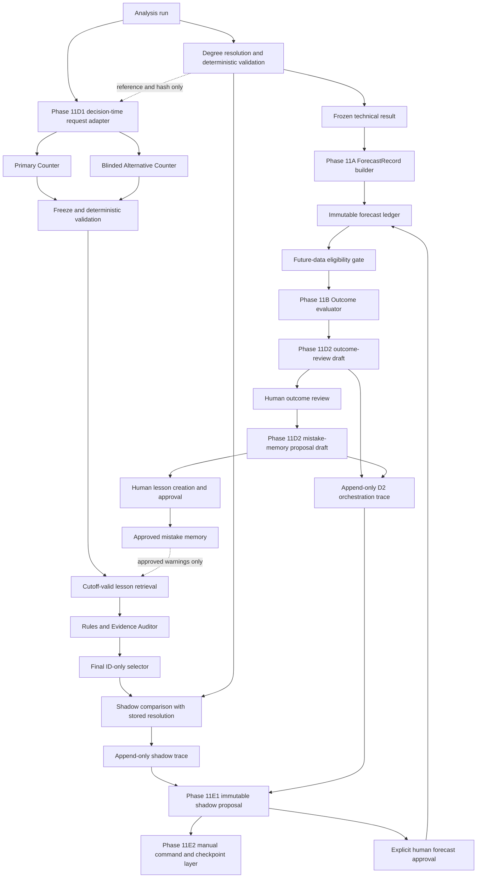

# Phase 11: Forecast Outcome Evaluation and Mistake Memory

## Status

- Specification version: `phase11-forecast-outcome-memory-1.6.0`
- Phase 11A implementation status: approved and implemented by the Phase 11A work
- Phase 11B implementation status: immutable observation sets and deterministic
  outcome evaluation implemented
- Phase 11C implementation status: human-reviewed decisions and mistake memory
  implemented as an offline, human-gated subsystem
- Phase 11D1 implementation status: decision-time technical agents implemented
  as an explicit, default-off shadow subsystem
- Phase 11D2 implementation status: outcome-review and mistake-memory proposal
  agents implemented as an explicit, default-off shadow subsystem
- Phase 11E1 implementation status: end-to-end six-agent orchestration and
  integration proof implemented as an explicit, default-off shadow subsystem
- Phase 11E2 implementation status: manual shadow-workflow command interface
  implemented with explicit model-call, persistence, and human-action gates
- Phase 11F and later: not implemented
- Authoritative technical boundary: the stored output of
  `ElliottAgent.resolve_degrees()` and deterministic validation

This document defines a future-safe architecture for freezing Elliott Wave
forecasts, evaluating them only against later data, diagnosing mistakes, and
allowing reviewed lessons to inform later analyses. It does not authorize
automatic learning, automatic count correction, probability calibration, or
trade execution.

## 1. Objectives

Phase 11 must make every forecast auditable as a decision-time object. It must:

1. preserve exactly what the system knew and claimed at the analysis cutoff;
2. evaluate claims only with data that became available after that cutoff;
3. keep price accuracy, timing accuracy, structural validity, and evidence
   quality separate;
4. diagnose failure without rewriting history;
5. retain human-approved lessons without learning from a single failure; and
6. retrieve relevant approved mistakes before a future forecast is finalized.

Phase 11 must not modify deterministic Elliott Wave hard rules. RSI, volume,
EWO, MACD, Fibonacci, duration, scale, and channels remain soft evidence.

## 2. Architectural Invariants

### 2.1 Technical independence

The initial technical analysis remains price-first. Company knowledge,
fundamentals, news, macro narratives, events, outcome history, and mistake
memory cannot alter the first Elliott count or degree-resolution pass.

### 2.2 Freeze before evaluation

The technical result is frozen after `resolve_degrees()` and its deterministic
validation complete. A forecast record references the source analysis run and
degree resolution and stores their canonical hashes. Later systems may assess
or criticize this result but cannot mutate it.

### 2.3 Decision-time isolation

All evidence inside a forecast must have an applicable cutoff at or before the
analysis cutoff. Outcome candles, revised fundamentals, later news, and later
human conclusions are excluded from forecast construction.

### 2.4 Append-only history

Forecasts, reviews, outcomes, and lessons are immutable revisions. Corrections
create a new record linked through explicit supersession. No accepted or failed
record is silently overwritten.

### 2.5 Human-gated learning

An outcome evaluation may identify a possible mistake. It cannot become active
memory until a human reviews and approves a generalized lesson. One failed
forecast is never sufficient evidence for an automatic rule change.

## 3. End-to-End Architecture

The Phase 11A adapter is deliberately separate from `analyze()` and
`resolve_degrees()`. The D1 and D2 shadow branches are offline and default-off.
The D1 counter packet contains neither stored response. D2 operates only after
the immutable Phase 11B evaluation exists; it cannot create a human review or a
mistake-memory record. E1 composes these branches only through explicit offline
calls and immutable returned checkpoints. E2 exposes those calls through a
manual, default-off command interface with a separate content-addressed
checkpoint chain. It does not create an active-pipeline hook.

## 4. Phase Boundaries

### Phase 11A: Specification and immutable forecast ledger

Implemented scope:

- typed forecast, hypothesis, claim, evidence, cutoff, and eligibility
  contracts;
- deterministic serialization and SHA-256 hashing;
- an additive two-table SQLite ledger;
- create, retrieve, and list persistence only;
- explicit supersession;
- a pure adapter for stored analysis-run and degree-resolution records.

### Phase 11B: Outcome observation and deterministic claim evaluation

Implemented scope:

- immutable inline post-cutoff candles and ordered manifests;
- claim eligibility and collision evaluation;
- independent price and timing results;
- main and alternative outcomes kept separate;
- deterministic replay and canonical hashing;
- an additive two-table SQLite ledger; and
- outcome records without diagnosis, explanation, or memory.

### Phase 11C: Human review and approved mistake memory

Implemented scope:

- immutable human reviews over one frozen Phase 11B evaluation;
- controlled failure diagnoses that remain reviewed evidence, not Elliott rules;
- immutable lesson proposals, supporting sources, counterexamples, and human
  lifecycle events;
- one-case exact warnings and threshold-gated broader lessons;
- cutoff-safe, deterministic, post-count retrieval; and
- an additive four-table SQLite ledger with no mutation or deletion methods.

### Phase 11D1: Decision-time technical agents in shadow mode

Implemented scope:

- independent Primary and Alternative Wave Counters operating on the same
  frozen decision-time technical packet;
- candidate freezing before deterministic validation and mistake-memory access;
- existing hard-rule and degree-shape validators applied independently to each
  candidate;
- post-count, cutoff-valid lesson retrieval for audit warnings only;
- a Rules and Evidence Auditor that cannot create or repair counts;
- a Final Technical Orchestrator restricted to frozen candidate IDs;
- an immutable shadow resolution and comparison with the stored degree
  resolution; and
- one additive append-only orchestration table.

Phase 11D1 is not connected to `analyze()`, `resolve_degrees()`, the CLI,
reports, ForecastRecord creation, Telegram, TradingView, or any active analysis
decision. Both the request and invocation must explicitly set
`shadow_mode=True`.

### Phase 11D2: Outcome learning agents in shadow mode

Implemented scope:

- an Outcome Reviewer Agent that drafts a bounded diagnosis from one immutable
  forecast, observation set, and deterministic outcome evaluation;
- a Mistake Memory Proposal Agent that drafts a bounded lesson proposal only
  after an explicitly approved or revised human outcome review;
- strict structured provider output, reference verification, deterministic
  replay, canonical hashing, and immutable failure traces;
- exact-case, scoped, and general proposal thresholds enforced before provider
  invocation and again when the draft is validated; and
- one separate additive append-only orchestration table.

Both the request and invocation must explicitly set `shadow_mode=True`.
Successful output always remains `human_action_required`. D2 cannot create or
revise a deterministic evaluation, human review, lesson, lesson source, or
lesson event. It is not connected to `analyze()`, `resolve_degrees()`, the CLI,
reports, ForecastRecord creation, Telegram, TradingView, or any live pipeline.

### Phase 11E1: End-to-end six-agent shadow workflow

Implemented scope:

- a pure orchestration layer in `phase11_shadow_workflow.py` that composes the
  four D1 roles and two D2 roles with the existing Phase 11A-C ledgers;
- immutable proposal, operator-approval, checkpoint, human-gate, result, and
  lineage contracts with canonical SHA-256 hashes;
- explicit transition validation from decision-time analysis through forecast
  approval, caller-supplied observations, deterministic evaluation, outcome
  review drafting, existing human review, and optional lesson drafting;
- the only E1 forecast-creation call, which requires an exact proposal hash,
  a human actor, typed claims, a fixed horizon, and a deterministically eligible
  candidate;
- deterministic stop states for successful, unresolved, insufficient, and
  incomparable outcomes;
- an integration proof that exact-case memory is absent from both independent
  counter packets, retrieved only after count freezing and validation, visible
  to the Auditor with provenance, unable to change hard validity, and unable to
  change a supplied Phase 5 ranking hash; and
- reuse of existing append-only persistence only, with no E1 database table.

Every call validates the preceding result and latest checkpoint hash. Legal
transitions are explicit and linear. Repeated calls with identical immutable
inputs and timestamps produce the same hashes and rely on the existing ledgers'
idempotent create operations. Skipped, repeated, branched, or out-of-order
transitions fail closed.

E1 remains disconnected from `analyze()`, `resolve_degrees()`, the CLI,
reports, Telegram, TradingView, schedulers, automatic data fetching, and all
production execution. It creates no human review, lesson, lesson source,
lesson event, confidence adjustment, probability, prompt update, hard-rule
change, or Phase 5 ranking change.

### Phase 11E2: Manual shadow-workflow command interface

Implemented scope:

- an additive `phase11-shadow` CLI group that preserves every pre-existing
  command and exposes `start`, `approve-forecast`, `register-observations`,
  `evaluate`, `draft-review`, `record-review`, `draft-lesson`,
  `record-lesson`, `activate-lesson`, `status`, and `verify`;
- explicit analysis-run, degree-resolution, cutoff, provider, model, source
  ID, and source-hash inputs, with no mutable `latest` selection;
- separate `--allow-model-call` and `--commit` capabilities so validation,
  provider execution, and persistence are distinguishable;
- caller-supplied Phase 11B normalized observation JSON only, with no market
  data fetcher;
- separate human commands for forecast approval, outcome-review recording,
  lesson recording, and lesson activation;
- immutable content-addressed JSON checkpoints under the application state
  directory, with canonical SHA-256 hashes, linear predecessors, deterministic
  operation keys, exclusive file creation, and idempotent exact retries;
- read-only status and verification commands covering checkpoint lineage,
  canonical hashes, database references, cutoff validation, D1/D2
  orchestration provenance, lesson event lineage, SQLite integrity, and
  foreign keys; and
- no E2 database table or migration.

The provider is never constructed unless `--allow-model-call` is present.
Without `--commit`, model-backed commands may return an advisory preview but
write neither a database record nor checkpoint. Deterministic commands use a
provider implementation that fails if called. Identical committed operations
return the existing checkpoint; stale or conflicting branches fail closed.

E2 remains manual and default-off. It is not called by `analyze()`,
`resolve_degrees()`, reporting, Telegram, TradingView, scheduling, startup, or
any active market workflow. It performs no automatic candle retrieval, human
decision, lesson creation, lesson activation, count correction, confidence
change, probability calculation, or trading action.

### Phase 11F and later

Any active-pipeline integration or broader learning behavior requires separate
approval. No future role may weaken the freeze, cutoff, human-approval, or
hard-rule boundaries.

## 5. Forecast Record Contract

`ForecastRecord` is the immutable forecast envelope. It contains:

- forecast ID, version, optional predecessor, and canonical content hash;
- source analysis-run ID and degree-resolution ID;
- exact UTC analysis cutoff and creation timestamp;
- symbol, exchange, analysis provider, model, market feed, session, timezone,
  adjustment, and price basis;
- every decision-time dataset cutoff and hash;
- the frozen technical premise and its source hashes;
- one main hypothesis and zero or more alternatives;
- typed target, invalidation, confirmation, and completion-window claims;
- supporting, contradictory, neutral, unavailable, and incomparable evidence;
- provider, model, prompt, calculation, schema, and policy versions;
- original uncalibrated confidence exactly as supplied; and
- evaluation eligibility and provisional state.

The record contains no outcome data, company knowledge, fundamental reasoning,
news, trade instruction, or revised confidence.

## 6. Dataset Cutoff Contract

Each `DatasetCutoff` identifies one exact decision-time dataset:

- stable dataset ID;
- source reference and timeframe;
- final included timestamp in UTC;
- canonical dataset hash and hash scope;
- optional original source-document hash;
- provider and feed identity;
- requested and resolved symbols;
- exchange, session, timezone, adjustment, and price basis;
- whether only completed candles were used;
- optional capture timestamp and bar count.

For legacy rows whose stored market summary lacks a raw file hash, the adapter
hashes the exact stored summary and records the hash scope as
`stored_dataset_summary`. It never reads the current file to manufacture a
historical hash.

## 7. Hypothesis Model

### 7.1 Main hypothesis

The main hypothesis stores its direction, degree, wave label, pattern family,
completion status, summary, exact count payload, original confidence, and IDs
of all claims and evidence that belong to it.

### 7.2 Alternative hypotheses

Alternatives remain separate records. Each preserves:

- its own count and direction;
- activation conditions;
- evidence needed to distinguish it;
- its own targets, invalidations, confirmations, time window, and evidence.

An outcome evaluator must not treat an alternative as if it were part of the
main count. Structural invalidation of one hypothesis does not alter the stored
others.

## 8. Typed Claims

### 8.1 Target claims

Targets are price ranges with direction, timeframe, price basis, rationale,
source waves, evidence references, and an explicit evaluation basis. The
default basis is `intrabar_touch`.

### 8.2 Invalidation claims

Invalidations are either price thresholds or explicit structural conditions.
Elliott price invalidations default to `intrabar_touch_or_breach`. A structural
condition that cannot be reduced to a price threshold requires a later human
structural review and cannot be inferred from a soft indicator.

### 8.3 Confirmation claims

Confirmations are represented separately from invalidations. Price confirmation
defaults to `candle_close`. Structural confirmation requires human review.

### 8.4 Expected completion windows

Each hypothesis may reference one or more exact UTC windows. A window stores
its timeframe, start rule, end rule, and rationale. Price and timing evaluation
must remain separate even when both use the same horizon.

## 9. Forecast Evidence

Evidence uses five states:

- `supporting`
- `contradictory`
- `neutral`
- `unavailable`
- `incomparable`

Every item identifies its hypothesis, technical category, rule class, statement,
source dataset IDs, source wave IDs, comparison reference, and reason where
needed.

RSI, volume, EWO, MACD, Fibonacci, duration, scale, and channel evidence are
always soft. Missing indicator data is `unavailable`; incompatible feed or
timeframe comparisons are `incomparable`. Neither state can invalidate a
structurally valid count.

## 10. Forecast Eligibility

Eligibility has two independent axes:

1. scoring status: `evaluable` or `legacy_unscorable`;
2. decision-time state: `final` or `provisional`.

A historical run without typed claims is `legacy_unscorable`. Present-day code
must not parse its old prose into targets or invalidations. Its count and
evidence remain available for audit only.

Completed candles are the default. Any use of an incomplete candle makes the
forecast `provisional` and requires a reason code. A provisional forecast may
later be evaluated, but its provisional origin must remain visible.

## 11. Outcome Evaluation Semantics

This section defines the implemented Phase 11B behavior.

### 11.1 Evaluation data

Evaluation data must:

- begin strictly after the forecast's applicable cutoff;
- identify provider, feed, symbol, timeframe, session, timezone, adjustment,
  price basis, capture time, and content hash;
- retain candle completeness;
- never replace what was known at forecast time; and
- be reproducible without a live refetch.

The candle interval convention is half-open: `[open_time_utc,
close_time_utc)`. A candle opening exactly at the forecast cutoff contains no
decision-time interval and is eligible. Any candle with an open before the
cutoff overlaps decision-time data and is rejected, even when it closes after
the cutoff. A completed candle must close no later than the lesser of the
actual evaluation cutoff and the predetermined horizon end. A partial candle
may be preserved as an immutable snapshot but is excluded from scoring.

Each observation set identifies one Phase 11A dataset and must match its
symbol, exchange, provider, feed, timeframe, session, timezone, adjustment,
and price basis. Expected opens are supplied by an explicit immutable session
schedule, generated by a declared continuous-interval policy, or marked
unavailable. The evaluator never infers an exchange calendar. Missing expected
opens, partial candles, unexpected opens, and declared legitimate session gaps
remain separate fields.

### 11.2 Claim outcomes

Claim, hypothesis, and forecast evaluation statuses use only:

- `succeeded`
- `failed`
- `partial`
- `unresolved`
- `insufficient_data`
- `incomparable`

No single opaque forecast score is authoritative.

### 11.3 Target and invalidation order

Targets use their stored touch or close basis. Invalidations use their stored
breach, close, or structural-review basis. If target and invalidation occur in
the same source candle and no lower-timeframe dataset proves their order, the
ordering result is `incomparable`. The evaluator must not assume favorable or
unfavorable ordering from an OHLC candle.

### 11.4 Price accuracy

Price accuracy evaluates only typed price and structure claims. It reports:

- target touched or not touched;
- invalidation breached or not breached;
- confirmation achieved or not achieved;
- ordering when provable; and
- maximum observable horizon used.

### 11.5 Timing accuracy

Timing accuracy evaluates the stored completion window independently. A target
may be price-correct but late, or time-correct without reaching the expected
price. Those outcomes must not be collapsed.

Completion windows are evaluated as typed timing claims. An event within any
frozen window succeeds on timing; an event outside every frozen window fails
on timing. No event is a timing failure only after complete horizon coverage.
It remains unresolved while the horizon is censored and is insufficient when
the sequence has missing or partial data.

### 11.6 Main and alternative outcomes

The main hypothesis and each typed alternative are evaluated independently.
An alternative becoming compatible with later data does not retroactively make
it the original main forecast. Outcome reports must preserve which hypothesis
was primary at decision time.

### 11.7 Deterministic aggregation

Aggregation is lexically defined and does not create a blended score:

1. A same-candle target/invalidation collision is `incomparable` unless an
   eligible registered lower-timeframe observation set places the events in
   different lower candles.
2. Missing, partial, unexpected, or schedule-unavailable data produces
   `insufficient_data`; it never proves that an unobserved event did not occur.
3. An invalidation proved before a target produces `failed` price status.
4. All targets and all machine-evaluable confirmations satisfied without a
   prior invalidation produce `succeeded` price status.
5. Some, but not all, targets satisfied produce `partial` price status.
6. A target followed by invalidation during the same frozen horizon remains
   `partial`, preserving both observations.
7. With complete data, an unmet target is `failed`; with a censored horizon it
   is `unresolved`.
8. A human-only structural claim remains `unresolved` and is never inferred
   from indicators.
9. Price and timing statuses are stored separately. Forecast-level status
   mirrors the main hypothesis only. An alternative cannot rescue or replace
   the original main forecast.

`incomparable`, `insufficient_data`, and `unresolved` take precedence over a
forced final conclusion. A price failure is a forecast failure. Price success
with timing failure, or another mixed complete result, is `partial`.

### 11.8 Excursion measurement

MFE and MAE are calculated only when the frozen hypothesis contains a typed
evaluation reference with `price`, `timestamp_utc`, and `price_basis`, and the
direction is `up` or `down`. The reference timestamp must be at or before the
forecast cutoff and its basis must match the observation feed. A compatible
legacy spelling using `reference_price`, `reference_timestamp_utc`, and
`reference_price_basis` is readable. The evaluator does not derive a reference
from a current chart or prose.

For an upward hypothesis:

- `MFE = max(max_high - reference_price, 0)`
- `MAE = max(reference_price - min_low, 0)`

For a downward hypothesis the signs reverse. Percentages divide each
non-negative excursion by the positive frozen reference price. Missing or
partial intervals make excursions unavailable. A contiguous but censored
sequence may report observed-to-cutoff excursions with censoring retained.

## 12. ForecastOutcomeReview Contract

`ForecastOutcomeReview` is an immutable human interpretation of exactly one
`ForecastOutcomeEvaluation`. It stores its review ID and version, parent review,
evaluation and forecast IDs and hashes, reviewed hypothesis and deterministic
status, reviewer identity, UTC review time, decision, diagnoses, corrected
interpretation, evidence references, notes, policy version, and content hash.

Allowed decisions are `approved`, `revised`, `rejected`, and
`needs_more_data`. `revised` requires a human-authored corrected interpretation,
but that text cannot change a candle, claim outcome, timing result, status, or
hash in Phase 11B. A review reporting a deterministic scoring defect must name
an already-created linear superseding evaluation. A later review may move from
the old evaluation to that named successor while retaining the parent review.

Review evidence and diagnosis references must resolve to IDs already present
in the immutable evaluation. Revisions increment by one, cannot branch, cannot
move to another forecast lineage, and cannot predate their parent.

## 13. Failure Diagnosis and Mistake Memory

### 13.1 Failure categories

`FailureDiagnosisType` distinguishes:

- wrong degree;
- wrong wave family;
- incorrect impulse/correction classification;
- premature wave-completion assumption;
- invalid Fibonacci anchors or scale;
- an alternative count improperly rejected;
- timing-window error;
- target error;
- RSI, volume, or EWO overweighting as separate categories;
- missing contradictory evidence;
- a data-quality problem;
- an ambiguous or incomparable outcome; and
- another explicitly documented human diagnosis.

A diagnosis is reviewed evidence. It cannot become a hard Elliott rule or
rewrite deterministic outcomes.

### 13.2 Lesson records and sources

`MistakeMemoryLesson` is a proposed immutable statement with a title, warning,
recommended audit check, explicit scope, initial source IDs, counterexample IDs,
possible duplicate IDs, optional exception rationale, policy version, and
canonical hash. A materially revised statement is a new lesson linked through
`supersedes_lesson_id`; it never edits the old row.

`LessonScope` explicitly records `exact_case`, `scoped`, or `general` plus all
applicable forecast IDs, symbols, asset classes, timeframes, Elliott degrees,
wave roles, pattern families, directions, indicator regimes, market regimes,
applicability conditions, and non-applicability conditions. Exact-case lessons
must include the forecast, symbol, timeframe, degree, role, family, and
direction so one observation cannot escape its original context.

Each `LessonSource` immutably links the lesson to one reviewed outcome,
evaluation, forecast, symbol, hashes, and availability timestamps. Sources are
labelled `supporting` or `counterexample`. Syndicating the same review under a
new source ID is forbidden. A deterministic deduplication key may identify
possible duplicate lesson proposals, but no records are merged automatically.

### 13.3 Human activation policy

Every lesson begins `proposed`. Its current state is derived from a linear
chain of human-authored `LessonEvent` records. Supported states are `proposed`,
`active`, `rejected`, `superseded`, and `retired`.

Activation rules are:

1. No lesson activates automatically.
2. A supporting source requires an `approved` or `revised` review whose frozen
   hypothesis outcome is `failed` or `partial`.
3. `unresolved`, `insufficient_data`, and `incomparable` evaluations cannot
   support activation.
4. One independent forecast may activate only an `exact_case` warning.
5. A `scoped` lesson requires at least two independent forecast sources.
6. A `general` lesson requires at least three independent forecasts across at
   least two symbols, unless the activating human records a non-empty explicit
   exception reason in the immutable activation event.
7. Counterexamples remain visible and are never converted into votes.

Approval changes no prompt, model weight, confidence, probability, indicator,
hard rule, current count, or Phase 5 analogue rank.

### 13.4 Lifecycle and supersession

The first event establishes `proposed`. Legal later transitions are
`proposed -> active|rejected|retired` and `active -> superseded|retired`.
Terminal records do not reopen. Supersession requires a separately stored
replacement lesson whose version increments by one and explicitly references
the old lesson. Every event stores actor, UTC timestamp, reason, considered
source IDs, hashes, and any documented generalization exception.

### 13.5 Point-in-time retrieval

`LessonRetrievalQuery` freezes the new analysis cutoff and available scope
fields. Blind mode deterministically returns no lessons. Otherwise retrieval:

1. verifies query, lesson, source, and event hashes;
2. reconstructs each lesson's state using only events at or before the cutoff;
3. requires every source used by the activation event to have been evaluated,
   reviewed, and added by that cutoff;
4. excludes future proposals, approvals, reviews, and outcome horizons;
5. matches explicit scope values without inferring free-text conditions;
6. orders exact-case, scoped, then general lessons, followed by descending
   matched-dimension count and stable lesson ID; and
7. returns warning text, audit check, matching reasons, conditions, and full
   source provenance.

`RetrievedLesson.audit_only` is always true. Retrieval can ask a reviewer to
check an alternative or omitted evidence; it cannot generate, invalidate, or
select a wave count. Replaying the same canonical inputs returns the same
ordered hashes.

## 14. Specialized Agent Responsibilities

Phase 11D1 implements the first four roles below in
`technical_agent_orchestrator.py`. Phase 11D2 implements the next two roles in
`outcome_learning_agents.py`. Phase 11E1 composes all six roles in
`phase11_shadow_workflow.py`. Every subsystem remains offline, default-off, and
shadow-only.

### Primary Wave Counter

- receives the frozen decision-time market packet, explicit pivot catalog, hard
  Elliott contract, and decision-time technical evidence only;
- creates one strongest price-first candidate and cites only supplied pivot and
  evidence IDs;
- cannot see the stored analysis or degree resolution, alternative output,
  mistake memory, fundamentals, news, company knowledge, or post-cutoff data;
  and
- is frozen and content-hashed before any lesson retrieval.

### Alternative Counter

- receives the same permitted packet as the Primary Counter while remaining
  blinded from its output;
- independently constructs one materially different candidate and records its
  distinguishing features;
- cannot see prior counts, outcomes, lessons, or non-technical context; and
- remains visible for audit but becomes selection-ineligible if its normalized
  structure merely duplicates the Primary candidate.

### Elliott Rules and Evidence Auditor

- receives only frozen candidates, immutable deterministic validation results,
  decision-time indicator evidence, and cutoff-valid active lessons retrieved
  after both counters are frozen;
- classifies support, contradiction, neutrality, unavailability, and
  incomparability without changing structural validity;
- preserves lesson IDs, hashes, warnings, and source-review provenance;
- cannot create, relabel, repair, promote, or invalidate a count; and
- cannot turn RSI, volume, EWO, MACD, Fibonacci, duration, scale, or channels
  into a hard rule.

### Final Technical Orchestrator

- receives frozen candidate IDs and compact validation/audit summaries, not an
  editable count payload;
- may select and rank only deterministically eligible candidate IDs;
- may return selected, unresolved, insufficient-evidence, or rejected-invalid;
- cannot invent a third count or bypass deterministic validation; and
- emits a shadow result that never replaces the stored degree resolution.

### Outcome Reviewer

- receives exactly one immutable forecast, one immutable observation set, and
  the corresponding deterministic Phase 11B evaluation;
- may draft concise diagnosis candidates and missing-data notes while copying,
  rather than reinterpreting, deterministic outcome, price, and timing states;
- verifies every cited claim, candle, evidence, hypothesis, wave, and degree ID
  against the frozen input;
- preserves all main and alternative hypothesis summaries separately;
- keeps unresolved, insufficient, and incomparable evaluations unresolved; and
- cannot mutate a source record, create a human review, or rewrite a
  deterministic result.

### Mistake Memory Agent

- receives only failed or partial deterministic outcomes whose linked human
  review is explicitly approved and contains a learning-supporting decision;
- may draft exact-case, scoped, or general lesson proposals using controlled
  failure categories and explicit applicability dimensions;
- enforces one-case exact scope, two-independent-forecast scoped evidence, and
  three-forecast/two-symbol general evidence without provider exceptions;
- verifies supporting and counterexample review provenance and checks active,
  cutoff-valid lessons for deterministic duplicate candidates;
- may suggest that no lesson should be created; and
- cannot create, approve, activate, merge, supersede, or edit a lesson or its
  lifecycle events.

### End-to-End Shadow Orchestrator

- implemented only as the offline, caller-driven Phase 11E1 workflow and not
  authorized for the active pipeline;
- enforces execution order and typed handoffs;
- freezes hashes at each boundary;
- blocks downstream execution after an unrecoverable validation failure;
- preserves all agent outputs and disagreements;
- does not make trades or override human approval.

## 15. Agent Communication Flow

The implemented Phase 11D1 flow is:

1. A pure adapter references a stored analysis run and degree resolution, but
   removes both stored response payloads and all non-technical context from the
   counter packet.
2. The request and invocation each explicitly enable shadow mode.
3. Primary and Alternative Counters independently receive the same immutable
   decision-time packet; neither receives the other's output.
4. Each successful structured output is frozen and hashed. Malformed output
   fails closed and is never silently replaced.
5. Existing degree-shape and hard Elliott validators inspect each frozen
   candidate; pivot, price, timestamp, cutoff, and evidence references are also
   verified against the request.
6. Only after both candidates are frozen and validation is complete may active,
   cutoff-valid lessons be retrieved. Blind mode performs no lesson-store read.
7. The Auditor classifies evidence and lesson warnings without changing a count
   or deterministic validity.
8. The Final Technical Orchestrator selects or ranks eligible frozen IDs only,
   or returns a non-selected status.
9. The result is compared deterministically with the existing stored degree
   resolution without mutation.
10. Callers may append the complete trace to
    `forecast_agent_orchestrations`; Phase 11D1 does not create a
    `ForecastRecord`.

All messages must carry record IDs, schema versions, applicable cutoffs, source
hashes, and validation status.

The implemented Phase 11D2 flow is:

1. Build an Outcome Reviewer request from one stored forecast, its exact
   observation set, and its deterministic evaluation; verify all hashes,
   linkages, cutoffs, and evidence references before provider execution.
2. Require explicit shadow enablement at both request and invocation boundaries.
3. Ask the provider for a strict structured draft containing only bounded
   conclusions; hidden reasoning is neither requested nor stored.
4. Reject invented references, missing alternative summaries, deterministic
   status rewrites, unsupported lower-timeframe claims, and forced conclusions
   for unresolved, insufficient, or incomparable outcomes.
5. Freeze the validated draft and complete orchestration trace. A human must
   separately create any Phase 11C outcome review.
6. Build a Mistake Memory Proposal request only from an explicitly approved or
   revised, correctly linked human review over a failed or partial evaluation.
7. Validate scope thresholds and all supporting, counterexample, existing
   lesson, lesson-source, and event provenance before provider execution.
8. Validate the proposal again after strict provider output, detect duplicates
   deterministically, and freeze the advisory trace. A human must separately
   create and activate any Phase 11C lesson.
9. Callers may append either complete trace to
   `forecast_outcome_learning_orchestrations`; no source record is mutated.

The implemented Phase 11E1 flow is:

1. Run the existing D1 technical roles in explicit shadow mode and persist the
   existing D1 trace. Freeze an advisory `ShadowForecastProposal`; do not create
   a forecast.
2. Require an `OperatorApproval` that binds the exact proposal ID/hash, human
   actor, selected eligible candidate, typed target and invalidation claims,
   direction, and fixed completion window. Only this call creates the existing
   Phase 11A `ForecastRecord`.
3. Accept only a caller-supplied, already immutable Phase 11B observation set
   linked to that forecast. E1 never fetches post-cutoff candles.
4. Run the existing deterministic Phase 11B evaluator and preserve main and
   alternative hypothesis results separately.
5. Run the D2 Outcome Reviewer in shadow mode and return a human-action gate;
   the draft cannot create a Phase 11C review.
6. Continue only from an existing persisted approved or revised Phase 11C
   review with exact forecast/evaluation lineage. Success completes without
   learning; unresolved, insufficient, or incomparable outcomes stop without
   learning; failed or partial outcomes expose a lesson-proposal gate.
7. Run the D2 Mistake Memory Proposal Agent only after the human gate. Its
   output remains advisory and cannot create or activate a lesson.
8. A separate proof path may replay a future technical request after a human has
   created and activated an exact-case lesson. It proves counter blindness,
   post-freeze retrieval, Auditor provenance, unchanged hard validity, and an
   unchanged caller-supplied Phase 5 ranking hash.

Retries are bounded and reuse the identical frozen packet, prompt, schema, and
version. Malformed or failed provider output creates an immutable failure trace
instead of a replacement diagnosis or lesson.

## 16. Overfitting and Hindsight Controls

- Never reconstruct old typed claims using current knowledge.
- Never expose post-cutoff data to forecast construction.
- Never redefine a target after observing price.
- Never change an evaluation basis after the outcome.
- Never convert one mistake into an active rule automatically.
- Require scope and counterexamples for every lesson.
- Keep indicator relationships soft.
- Preserve rejected and superseded lessons.
- Keep main-count and alternative-count outcomes separate.
- Record unresolved and incomparable outcomes instead of forcing success or
  failure.
- Version evaluators, prompts, models, policies, and schemas.
- Re-run deterministic evaluation against frozen fixtures before accepting an
  evaluator change.

## 17. Persistence Design

### 17.1 Phase 11A tables

`forecast_schema_versions` stores immutable schema manifests.

`forecast_records` stores one canonical JSON record per immutable forecast,
with restricted foreign keys to `analysis_runs`, `degree_resolutions`, the
schema manifest, and an optional predecessor forecast.

No existing table is changed and no historical forecast is backfilled.

### 17.2 Supersession

A first record has version 1 and no predecessor. A replacement has the prior
record's ID, increments its version by exactly one, and remains in the same
symbol lineage. One predecessor cannot have two silent replacements. Both rows
remain readable.

### 17.3 Phase 11B tables

Phase 11B adds only:

- `forecast_observation_sets`, containing immutable normalized candles,
  completeness, manifests, policy references, source hashes, and explicit
  supersession; and
- `forecast_outcome_evaluations`, containing deterministic claim and
  hypothesis outcomes plus immutable references to their forecast and
  observation sets.

Both tables are append-only, use restricted deletion, and expose create,
retrieve, and list operations only. A superseding version increments by one;
predecessors remain readable and cannot branch silently.

### 17.4 Phase 11C tables

Phase 11C adds only:

- `forecast_outcome_reviews` for linear immutable human review revisions;
- `mistake_memory_lessons` for immutable proposed lesson versions;
- `mistake_memory_sources` for supporting and counterexample review links; and
- `mistake_memory_events` for the human-authored status chain.

All foreign keys use `ON DELETE RESTRICT`. Eight triggers forbid updates and
deletes. Unique parent indexes prevent review, lesson-supersession, and event
branches. `UNIQUE(lesson_id, sequence_number)` serializes event ordering inside
the database transaction. No existing table is altered or backfilled.

### 17.5 Phase 11D1 table

Phase 11D1 adds only `forecast_agent_orchestrations`. Each row stores the full
canonical orchestration JSON plus mirrored source IDs, cutoff, decision-time
input hash, four frozen role-result hashes, validation-manifest hash, shadow
resolution and comparison hashes, retrieved lesson IDs, selected candidate IDs,
provider/model/prompt/policy/schema versions, status, warnings, errors, and the
record content hash.

The table has `ON DELETE RESTRICT` foreign keys to `analysis_runs`,
`degree_resolutions`, and an optional predecessor orchestration. A unique
predecessor index prevents supersession branches. Update and delete triggers
make rows append-only. Persistence exposes create, retrieve, and list methods
only. The migration is transactional, creates a SQLite backup before changing
an existing database, and writes a pre/post integrity audit when applied.

### 17.6 Phase 11D2 table

Phase 11D2 adds only `forecast_outcome_learning_orchestrations`. It remains
separate from `forecast_agent_orchestrations`, whose ownership and schema stay
exclusive to Phase 11D1.

Each D2 row stores the canonical orchestration JSON and mirrors its role,
  status, human-action requirement, forecast, role-specific observation,
  evaluation, approved-or-revised-review, optional existing-lesson references,
provider/model/prompt/policy versions, frozen-input and structured-draft
hashes, warnings, validation errors, UTC timing, schema/calculation versions,
and record hash.

Kind-specific constraints require forecast, observation, and evaluation for an
`outcome_reviewer` trace while forbidding review and lesson references. A
  `mistake_memory_proposal` requires forecast, evaluation, and an approved or
  revised linked human review, forbids an observation reference in the
  orchestration row, and
may reference one existing lesson. Embedded supporting and counterexample IDs
are approved human review IDs because a draft does not yet own Phase 11C lesson
sources; possible-duplicate IDs are existing lesson IDs. Persistence verifies
all of them against the database.

All foreign keys use `ON DELETE RESTRICT`. A unique predecessor index enforces
linear same-kind supersession. Update and delete triggers make the table
append-only. Persistence exposes create, retrieve, and list methods only. The
migration is transactional, creates a database backup and pre-migration audit
before applying SQL, writes a final audit, and verifies that the D1 table,
indexes, and triggers retain their original SQL hashes.

### 17.7 Phase 11E1 persistence boundary

Phase 11E1 adds no database table and performs no migration. It composes the
existing Phase 11A-D2 append-only ledgers and returns its immutable checkpoint
chain to the caller. D1 and D2 orchestration traces, forecasts, observation
sets, evaluations, human reviews, and any later human-created lessons retain
their original table ownership and validation rules. No production case,
forecast, review, or lesson is fabricated during migration or startup.

### 17.8 Phase 11E2 checkpoint boundary

Phase 11E2 adds no database object or migration. Durable manual workflow state
is stored as immutable JSON in
`<database-directory>/phase11-shadow-workflows`. Each filename contains the
workflow ID, sequence, durable stage, and canonical content hash. Each payload
stores the preceding checkpoint hash, deterministic operation key, complete E1
result, explicit human-action record references, policy/schema versions, UTC
recording time, and SHA-256 content hash.

Files are created exclusively and never replaced. The loader rejects unsafe
workflow or stage path components, filename/payload disagreement, hash
tampering, non-contiguous sequences, predecessor disagreement, duplicate
operation keys, changed E1 lineage, and branches. The database records retain
their existing table ownership and append-only rules; the JSON chain only
coordinates their exact immutable references.

## 18. Canonicalization and Tamper Detection

Canonical JSON uses:

- UTF-8;
- ASCII escaping;
- recursively sorted mapping keys;
- compact separators;
- finite JSON numbers only; and
- normalized UTC timestamps with second precision.

Each forecast, candle, evaluation policy, candle manifest, observation set,
outcome evaluation, review, diagnosis-bearing review, lesson, lesson source,
lesson event, retrieval query, retrieved result, technical-agent request,
candidate, role result, validation result, evidence audit, shadow resolution,
shadow comparison, outcome-review request/draft, diagnosis candidate,
mistake-proposal request/draft, duplicate candidate, agent result, and
orchestration uses SHA-256 over its complete canonical payload except its own
`content_hash` field. Phase 11E1 checkpoints, forecast proposals, operator
approvals, human-action gates, lineage manifests, and workflow results use the
same rule. IDs and all source references remain in hashed payloads.
Provider raw output is retained only as a hash; only typed output references and
concise summaries enter an orchestration. The observation set embeds normalized
candles, so replay never depends on a mutable CSV or current live file.

## 19. Validation Rules

A record is rejected when any of the following is true:

- a source run or degree resolution is absent or mismatched;
- a dataset extends beyond the analysis cutoff;
- the frozen premise hash, symbol, cutoff, or resolution reference differs;
- company knowledge, fundamentals, news, or scenario content enters the frozen
  technical structure;
- an ID is duplicated or a reference is dangling;
- soft indicator evidence is labelled as a hard structural rule;
- unavailable or incomparable evidence lacks a reason;
- an incomplete candle is not marked provisional;
- an evaluable forecast lacks a target, invalidation, or timing window;
- a legacy-unscorable forecast contains reconstructed typed claims;
- supersession is missing, branched, or incorrectly versioned;
- a review attempts to rewrite a deterministic result;
- a scoring-error review lacks its superseding evaluation;
- a lesson source refers to an unapproved review or incompatible hash;
- a one-case lesson escapes exact-case scope;
- a broader lesson lacks its approved evidence threshold;
- a lesson status is inferred without a valid human event chain;
- retrieval uses a proposal, approval, review, or outcome horizon after its
  analysis cutoff;
- a technical-agent request contains a forbidden prior result, lesson,
  non-technical context, or post-cutoff market timestamp;
- an agent candidate invents or changes a supplied price, timestamp, pivot, or
  evidence reference;
- an Alternative candidate duplicates the normalized Primary structure and is
  nevertheless marked selection-eligible;
- lesson retrieval occurs before both candidate outputs are frozen and
  deterministically validated;
- an Auditor creates or repairs a count, changes deterministic validity, or
  treats soft evidence as a hard invalidation;
- a Final Technical Orchestrator names a candidate that was not frozen and
  selection-eligible;
- shadow execution is attempted without explicit enablement in both the
  request and invocation;
- an Outcome Reviewer request does not bind one matching forecast, observation
  set, and deterministic evaluation or exposes post-horizon/future data;
- an Outcome Reviewer draft invents a reference, omits an alternative, rewrites
  a deterministic result, or forces a failed diagnosis from an unresolved,
  insufficient, or incomparable result;
- a Mistake Memory Proposal request lacks an approved or revised correctly
  linked human review, uses a successful/unresolved/incomparable outcome, or
  violates the exact/scoped/general evidence thresholds;
- a mistake proposal cites an unknown supporting review, counterexample review,
  possible duplicate, lesson source, or lesson event, or any cited lesson state
  depends on information after the request cutoff;
- a D2 agent attempts to create or activate a review or lesson, modify a source
  record, or bypass `human_action_required`;
- the D2 orchestration kind and its role-specific database references disagree;
- an E1 stage is skipped, repeated, branched, or called with a checkpoint that
  is not the latest verified checkpoint;
- forecast approval does not bind the exact proposal ID and hash, human actor,
  fixed horizon, typed claims, and eligible frozen candidate;
- observation acceptance attempts to fetch data or receives candles outside the
  immutable Phase 11B observation-set boundary;
- an E1 outcome-review or lesson-proposal draft bypasses its explicit human gate;
- exact-case mistake memory reaches either independent counter packet, is read
  before both candidates are frozen and validated, changes hard validity, or
  changes an independently supplied Phase 5 retrieval-order hash;
  or
- any canonical hash fails.

## 20. Required Test Strategy

### Phase 11A

- frozen dataclass behavior and nested immutability;
- canonical serialization, key-order independence, and hash stability;
- payload, premise, and database tampering detection;
- UTC and per-dataset cutoff enforcement;
- completed and incomplete candle policy;
- main/alternative separation and reference integrity;
- target, invalidation, confirmation, and window validation;
- soft-indicator behavior;
- legacy-unscorable adaptation without reconstruction;
- atomic migration rollback;
- exact two-table migration and append-only enforcement;
- restricted foreign keys and zero violations;
- create/get/list round trips and idempotent insertion;
- linear supersession;
- legacy database readability; and
- unchanged analysis, degree-resolution, CLI, and package interfaces.

### Phase 11B

- strict post-cutoff data isolation;
- partial, duplicate, out-of-order, missing, and legitimate session-gap cases;
- provider, feed, adjustment, and price-basis compatibility;
- target/invalidation ordering with lower-timeframe proof;
- separate price and timing evaluations;
- multiple targets and independent alternatives;
- MFE/MAE availability only from frozen references;
- canonical tamper detection and deterministic replay;
- observation and evaluation supersession;
- two-table migration rollback and append-only enforcement;
- restricted foreign keys and zero violations; and
- unchanged Phase 11A and public analysis interfaces.

### Phase 11C

- immutable review decisions and linear review revisions;
- deterministic-result protection and scoring-error supersession;
- all controlled failure-diagnosis categories;
- unresolved and incomparable activation exclusion;
- one-case exact warning behavior;
- scoped and general evidence thresholds plus documented human exception;
- supporting sources and counterexamples;
- duplicate proposal detection without merging;
- human lifecycle transitions and lesson supersession;
- point-in-time cutoff isolation and blind-mode isolation;
- exact/scoped/general deterministic ranking and stable-ID ties;
- serialization, tamper detection, and deterministic retrieval replay;
- four-table migration rollback and append-only enforcement;
- restricted foreign keys and zero violations; and
- unchanged analysis, Phase 5 retrieval, CLI, and package interfaces.

### Phase 11D1

- immutable contracts, nested freezing, canonical serialization, hash
  continuity, tamper detection, and deterministic replay;
- Primary/Alternative blindness and identical permitted decision-time inputs;
- candidate freeze and validation before any lesson-store access;
- post-cutoff, prior-count, fundamental, news, company-knowledge, and forbidden
  reference rejection;
- existing hard-rule enforcement and soft-indicator non-invalidation;
- materially duplicated alternatives retained for audit but excluded from
  selection;
- Auditor count-creation rejection and Final selection-only enforcement;
- no forced count after malformed, invalid, missing, or partial provider output;
- approved lesson provenance and blind-mode no-retrieval behavior;
- deterministic fake provider, Packet fail-closed behavior, and offline Ollama
  strict-output compatibility;
- explicit default-off shadow activation and no live-interface changes;
- one-table transactional migration, backup/audit, rollback, append-only
  triggers, restricted foreign keys, idempotency, and linear supersession; and
- full Phase 11 and repository regression compatibility.

### Phase 11D2

- immutable requests, drafts, results, orchestrations, nested freezing,
  canonical hashes, tamper detection, and deterministic replay;
- shadow mode disabled by default at request and invocation boundaries;
- exact forecast/observation/evaluation linkage and explicit future-candle
  rejection;
- strict reference validation across claims, candles, evidence, hypotheses,
  waves, degrees, reviews, lesson sources, events, and duplicate lessons;
- all deterministic outcome states, main/alternative separation, same-candle
  ambiguity, and unavailable/incomparable preservation;
- deterministic-result rewrite rejection and no human-review creation;
- explicitly approved or revised review and failed/partial outcome gates for
  proposal requests;
- exact/scoped/general evidence thresholds and single-case
  over-generalization rejection;
- deterministic duplicate detection without merge, lesson creation, event
  creation, approval, or activation;
- bounded identical-input retry behavior, malformed-output failure traces,
  fake-provider replay, Packet fail-closed behavior, and offline strict-output
  provider compatibility;
- one-table transactional migration, pre-migration backup/audit, final audit,
  rollback, append-only triggers, restricted foreign keys, idempotency, linear
  supersession, and protected D1 SQL-hash verification; and
- unchanged Phase 11A-D1, active analysis, CLI, reports, Phase 5 ranking, and
  repository behavior.

### Phase 11E1

- immutable checkpoints, proposals, operator approvals, human-action gates,
  lineage manifests, and complete workflow results;
- canonical serialization, hash continuity, tamper detection, and deterministic
  replay across every stage;
- strict stage ordering, latest-checkpoint validation, no branching, no skipped
  gates, and deterministic idempotence for identical immutable inputs;
- explicit human forecast approval as the only forecast-creation boundary;
- caller-supplied Phase 11B observation sets with no fetching or future-candle
  access during decision-time analysis;
- deterministic main/alternative outcome evaluation and preserved unresolved,
  insufficient, and same-candle incomparable stop states;
- outcome-review drafts that cannot create human reviews and lesson proposals
  that require an existing approved or revised human review;
- success paths that terminate without proposing a lesson and failed/partial
  paths that retain `human_action_required`;
- proof that exact-case lessons are absent from counter input hashes, retrieved
  only after freezing, visible to the Auditor with provenance, and unable to
  alter hard validity or a supplied Phase 5 ranking hash;
- D1/D2 provider failure and partial-completion propagation without unsafe
  downstream execution;
- no E1 table, migration, report, Telegram, TradingView, or active-pipeline
  integration; E2 is only a manual wrapper around the E1 API; and
- full Phase 11 and repository regression compatibility.

### Phase 11E2

- additive parser registration and compatibility with all existing commands;
- explicit IDs, cutoffs, provider/model configuration, shadow mode, model-call
  permission, commit permission, typed claims, and hash confirmations;
- dry-run execution with no database or checkpoint writes;
- deterministic evaluation with a provider that cannot be called;
- separate human review, lesson recording, and activation gates;
- Phase 11C evidence thresholds retained during lesson activation;
- immutable append-only checkpoint files, canonical hash verification,
  content-addressed names, path-traversal rejection, exact retry idempotence,
  stale predecessor rejection, and conflicting branch rejection;
- read-only status and verification over D1, D2, forecast, observation,
  evaluation, review, lesson, source, event, cutoff, SQLite, and foreign-key
  lineage;
- fake-provider and temporary-state tests with no production records; and
- no E2 database schema, provider implementation, fetcher, scheduler, report,
  Telegram, TradingView, trading, or active-pipeline integration.

### Later phases

- active-pipeline orchestration after separate approval;
- production execution policy and user-facing presentation; and
- deterministic replay policy across future agent versions.

## 21. Explicitly Deferred Work

Phase 11E2 still does not implement:

- live post-endpoint candle fetching;
- active analysis-pipeline integration;
- automatic ForecastRecord creation without explicit operator approval;
- shadow output in reports, Telegram, or TradingView;
- automatic lesson insertion into prompts or reports;
- production model execution as part of the live pipeline;
- automatic human review creation;
- automatic lesson, source, or lifecycle-event creation;
- automatic lesson approval, activation, merge, or supersession;
- threshold overrides or generalization from one reviewed forecast;
- prompt, model-weight, confidence, or probability adaptation;
- probability calibration;
- automatic wave resolution;
- trade execution, entry, exit, or position sizing.

Each deferred capability requires a separately approved phase and, where
needed, a separately approved additive migration.
